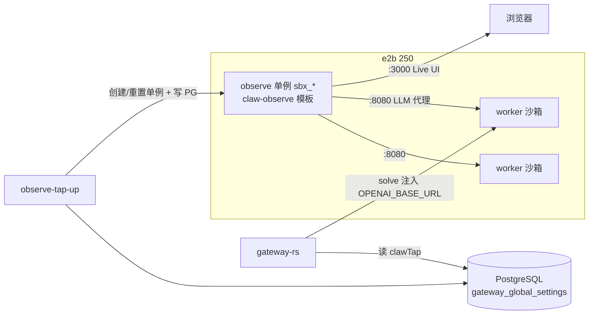

# e2b Observe（clawTap）排障手册

Author: kejiqing

**适用：** `CLAW_INTERACTIVE_BACKEND=e2b` + `CLAUDE_TAP_MODE=off`（tap 不在 gateway 宿主机起侧车，由 **e2b observe 单例**承载）。

**相关脚本：** `deploy/e2b/e2b-tap-live-up.py` · `deploy/stack/gateway.sh observe-tap-up`  
**相关 UI：** Admin → 全局 → Observe Tap（只读展示 +「重置 Tap」）

---

## 1. Observe 是什么



| 端口 | 域名模式 | 用途 |
|------|----------|------|
| **3000** | `http://3000-{sandboxId}.{CLAW_E2B_DOMAIN}` | claude-tap **Live**（trace 可视化） |
| **8080** | `http://8080-{sandboxId}.{CLAW_E2B_DOMAIN}` | **LLM 代理**（worker solve 的 `OPENAI_BASE_URL`） |

- **单例元数据：** e2b sandbox `metadata.clawRole=observe-singleton`，`metadata.clusterId=CLAW_CLUSTER_ID`
- **PG 契约：** `gateway_global_settings.settings_json.clawTap`（按 **cluster_id** 分行，见 §4）
- **不由 Admin 手填 252 IP**；`observe-tap-up` 创建沙箱后自动写入 `proxyBaseUrl` / `liveBaseUrl` / `e2bObserveSandboxId`

模板 `claw-observe` 的 `startCmd`（`Dockerfile.claw-observe-selfhosted`）在沙箱创建时启动：

```text
claude-tap --tap-live --tap-host 0.0.0.0 --tap-port 8080 --tap-live-port 3000 ...
```

`observe-tap-up` **不会**再 fc_exec 第二条启动路径。

---

## 2. 常见现象 → 优先怀疑

| 现象 | 常见根因 | 第一节动作 |
|------|----------|------------|
| Admin 显示「等待 observe-tap-up」 | PG `clawTap` 空或 `updatedAtMs=0` | §5 跑 `observe-tap-up` |
| `clawTap` 里是 `192.168.9.252` | **迁移前手填地址**，252 上无 tap | §5 `--reset`；勿在 Admin 改 host |
| 沙箱在列表里但 tap **502** | 单例进程挂了 / 模板 startCmd 失败 | §5 `--reset` 重建 |
| `observe-tap-up` 沙箱 OK 但 PG 仍空 | **`e2b_pg_settings.py` 用错列**（见 §4） | 升级脚本后重跑 |
| Gateway `/healthz` → `clawTapCluster.consistency=cluster_mismatch` | clusterId / clusterHash 与 tap `/healthz` 不一致 | 核对 `CLAW_CLUSTER_ID` + §6 验收 |
| Gateway `/readyz` **503** | `consistency ≠ strict` | 先修好 observe，再查 gateway |
| `column "singleton_id" does not exist` | PG 已迁 `cluster_id` PK，旧脚本未更新 | 确认 `e2b_pg_settings.py` 用 `cluster_id` |

---

## 3. 快速诊断（复制执行）

在 **claw-code 根目录**，`.env` 已含 `CLAW_E2B_*`、`CLAW_GATEWAY_DATABASE_URL`、`CLAW_CLUSTER_ID`：

```bash
set -a && source .env && set +a

# 3.1 PG 里本集群 clawTap（应有 proxyBaseUrl / e2bObserveSandboxId）
.venv-fc/bin/python3 -c "
from deploy.e2b.e2b_pg_settings import load_settings_json_key
import json
print(json.dumps(load_settings_json_key('clawTap'), indent=2))
"

# 3.2 e2b 上是否有 observe 单例
curl -sS -H \"X-API-Key: ${CLAW_E2B_API_KEY}\" \"${CLAW_E2B_API_URL}/sandboxes\" \
  | python3 -c "
import json,sys
rows=json.load(sys.stdin)
for r in rows:
    m=r.get('metadata') or {}
    if m.get('clawRole')=='observe-singleton' and m.get('clusterId')=='${CLAW_CLUSTER_ID}':
        print(r.get('sandboxID'), r.get('state'), r.get('templateID'))
"

# 3.3 从 PG 取 sandboxId 后验 proxy / live（替换 SBX）
SBX="<e2bObserveSandboxId>"
curl -sS -o /dev/null -w "live %{http_code}\n" "http://3000-${SBX}.${CLAW_E2B_DOMAIN}/"
curl -sS "http://8080-${SBX}.${CLAW_E2B_DOMAIN}/healthz"

# 3.4 Gateway 集群一致性（本机 gateway 默认 18088）
curl -sS "http://127.0.0.1:18088/healthz" | python3 -c "
import json,sys; d=json.load(sys.stdin)
print('clawTapCluster:', json.dumps(d.get('clawTapCluster'), indent=2))
"
```

**健康标准：**

- `clawTap.proxyBaseUrl` 形如 `http://8080-sbx_*.spone.xyz`（**不是** `192.168.9.252`）
- `GET http://8080-{sbx}.{domain}/healthz` → HTTP 200，`clusterId` = 当前 `CLAW_CLUSTER_ID`
- Gateway `clawTapCluster.consistency` = **`strict`**

---

## 4. PG 写入：`cluster_id` 不是 `singleton_id`

Phase-2 迁移后，`gateway_global_settings` **主键为 `cluster_id`**（每集群一行），`singleton_id` 列已删除。

`deploy/e2b/e2b_pg_settings.py` 必须：

- 读/写 `WHERE cluster_id = <CLAW_CLUSTER_ID>`
- `merge` 前 `INSERT … ON CONFLICT (cluster_id) DO NOTHING` 确保行存在

若仍用 `WHERE singleton_id = 1`，`observe-tap-up` / `nas-api-up` / `build-claw-observe-selfhosted.py` 写 PG 会失败，表现为：

```text
column "singleton_id" does not exist
```

或脚本 stderr 有 `warn: skip PG … persist`，但沙箱其实已创建——**最容易卡很久的一种**。

---

## 5. 修复：重建 observe 单例

```bash
cd ~/work/claw-code
set -a && source .env && set +a

# 推荐：杀旧单例 + 新建 + 等 Live 就绪 + 写 PG
./deploy/stack/gateway.sh observe-tap-up --reset

# 仅复用已有单例（进程正常、PG 丢了时）
./deploy/stack/gateway.sh observe-tap-up --reuse

# JSON 输出（CI / Admin API 同款）
./deploy/stack/gateway.sh observe-tap-up --reset --json
```

**Admin 等价：** `POST /v1/gateway/global-settings/observe-tap/reset`（gateway 容器内调同一 Python 脚本）。

**耗时：** 通常 20–120s（等模板 `startCmd` 把 Live :3000 拉起来）。

**失败时：**

1. 模板是否存在：`curl -sS -H "X-API-Key: $CLAW_E2B_API_KEY" "$CLAW_E2B_API_URL/templates" | grep claw-observe`
2. 缺模板 → 开发机：`./deploy/e2b/build-claw-observe-selfhosted.py` 或 `build-selfhosted-templates.sh observe`
3. Live 一直不通 → 250 上看 e2bserver 日志；必要时 `--reset` 再试

---

## 6. 完整验收清单

```bash
set -a && source .env && set +a
SBX=$(.venv-fc/bin/python3 -c "from deploy.e2b.e2b_pg_settings import load_settings_json_key; print(load_settings_json_key('clawTap').get('e2bObserveSandboxId',''))")

test -n "$SBX" && echo "PG sandboxId: $SBX"
curl -fsS "http://3000-${SBX}.${CLAW_E2B_DOMAIN}/" >/dev/null && echo "live OK"
curl -fsS "http://8080-${SBX}.${CLAW_E2B_DOMAIN}/healthz" | grep -q "\"clusterId\":\"${CLAW_CLUSTER_ID}\"" && echo "proxy healthz OK"
curl -fsS "http://127.0.0.1:18088/healthz" | grep -q '"consistency":"strict"' && echo "gateway strict OK"
```

预发 252 全栈串联见 [`pre-252-e2b-pipeline.md`](./pre-252-e2b-pipeline.md)（`e2b-singletons-up` 含 observe）。

---

## 7. 多集群注意

同一 PG（250）上有多行 `gateway_global_settings`（`local-dev`、`pre-claw-01`、`prod-claw-01` …）。

- **`observe-tap-up` 只更新当前 `.env` 的 `CLAW_CLUSTER_ID` 那一行**
- 其他集群若 `clawTap.host` 仍是 `192.168.9.252`，需在该环境 `.env` 设对应 `CLAW_CLUSTER_ID` 后分别跑 `observe-tap-up --reset`
- **不要**把 252 的 tap 地址抄进 Admin「全局推理」——e2b 模式下该页已改为只读提示

---

## 8. 与旧方案的区别

| 项 | 旧（252 手填 / 宿主机 tap） | 当前（e2b observe 单例） |
|----|----------------------------|--------------------------|
| tap 进程位置 | 252 或 Mac `gateway.sh tap-up` | e2b 沙箱 `claw-observe` |
| Admin 配置 | 手填 host:port | **只读**；`observe-tap-up` 写 PG |
| `CLAUDE_TAP_MODE` | `local` / `docker` | **`off`**（e2b 模式） |
| Live URL | 可能 `127.0.0.1:3000` | `http://3000-sbx_*.domain` |
| LLM 代理 URL | 宿主机 :8080 | `http://8080-sbx_*.domain` |

Live 域名方案详见 [`docs/ovs-chat/E2B-OBSERVE-LIVE-VIEWER-PATH.md`](../../docs/ovs-chat/E2B-OBSERVE-LIVE-VIEWER-PATH.md)。

---

## 9. 本次踩坑记录（2026-07）

**症状：** `sbx_6762a7f443f8` 在 e2b 列表中 running，但 `8080-sbx_…` 返回 502；PG `clawTap.host=192.168.9.252`；`observe-tap-up` 无法持久化。

**根因链：**

1. PG 已迁 `cluster_id`，`e2b_pg_settings.py` 仍查 `singleton_id` → 写入失败  
2. `clawTap` 残留预发 252 手填地址，gateway 打到无 tap 的 252  
3. 旧 observe 单例进程异常，需 `--reset` 而非 `--reuse`

**修复：** 更新 `e2b_pg_settings.py` + `observe-tap-up --reset` → 新单例 `sbx_cc789e12d3a2`，`clawTapCluster.consistency=strict`。
