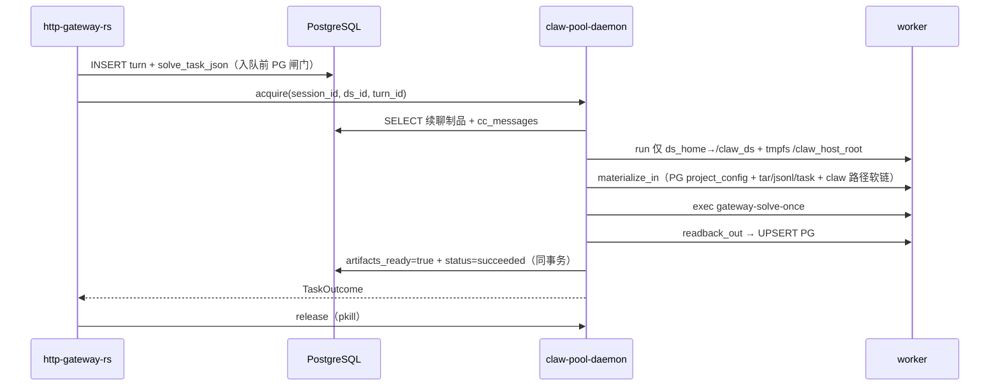

# HTTP Gateway（Rust）：容器池隔离方案

面向 **`http-gateway-rs`**：用 **容器池**（**Docker** 或 **Podman**）承载每次 solve 的 **进程与文件系统视图**，避免与网关进程共享 `cwd` / 地址空间。MCP 假设为 **HTTP/SSE**（容器内只需出网到 URL，无需在镜像里装 stdio MCP 运行时）。

**单机 + Docker**：与下文 Podman 叙述 **一一对应**，仅命令与宿主机别名不同（见 §「Docker 单机对照」）。

Author: kejiqing

**本地怎么起栈（稳定步骤）**：只看 `deploy/stack/README.md` 即可；本文偏设计与配置项说明，不负责替代运维手册。

## 1. 要解决什么问题

| 现状 | 问题 |
| --- | --- |
| ~~`run_solve_request` 里直接 `run_runtime_prompt`~~（已删除） | 历史上与网关 **同进程** 跑 solve 会踩 **进程级 cwd**；现网 **只** 走 worker 容器池。 |
| 每请求 `docker run` / `podman run` 全新容器 | **冷启动** 往往 0.5～数秒，并发时抖动大。 |

**容器池**：预先维持 **N 个已启动的空闲容器**（或 N 个「槽位」），solve 来时 **占用一个槽 → 挂载/同步工作区 → 在容器内执行 claw → 归还槽**。摊销掉「创建容器 + 启动进程」的成本，把常见路径压到 **接近一次 `docker exec` / `podman exec` + 准备目录** 的耗时。

## 2. 核心概念（怎么运作）

### 2.1 三个角色

1. **网关进程（`http-gateway-rs`）**  
   - 仍负责 HTTP、任务队列、`dsId` 锁、写 **`ds_home/.claw/settings.json`**（与现在一致）。  
   - **不再**在网关进程里跑 `claw` solve；**只管租借与编排**：经 **`PoolRpcClient`** 调宿主机 **`claw-pool-daemon`** 完成 `acquire` → `dispatch`（`docker exec` / `podman exec`）→ 读结果 → `release`；取消时 **`force_kill`**。  
   - **不**决定池大小、**不**调 `ensure_warm`（这些在 **池守护进程** 内）。

2. **池守护进程（`claw-pool-daemon`，宿主机）**  
   - **进程启动时一次性**从环境变量读取 **`CLAW_DOCKER_POOL_SIZE` / `CLAW_DOCKER_POOL_MIN_IDLE`**（Podman 对应 `CLAW_PODMAN_POOL_*`）等并固定；**不做热更新**（改参须重启进程）。  
   - 内部负责 **`ensure_warm` / 缩 idle**、worker **创建与汰换**；维护 **上限 N** 与状态机 **idle → leased → idle**（lease 超时则强制回收）。  
   - 通过 **TCP 或 Unix socket** 对网关暴露 JSON-RPC 式协议（`CLAW_POOL_DAEMON_TCP` / `CLAW_POOL_DAEMON_SOCKET`）。

3. **Worker 容器**  
   - 镜像：与现网一致的 **Debian slim + `claw`（+ 可选 `ca-certificates`/`curl`）**（见 `deploy/stack/Containerfile.gateway-rs` 的 runtime 层思路）。  
   - 容器 **长期存活**（池内 idle 时也跑着），里面可以是 **sleep infinity** 或 **最小 init**，实际干活靠 **`docker exec` / `podman exec`**。

### 2.2 一次 solve 的路径（pool bind v1）

要点：

- **唯一 bind**：`work_root/ds_{id}` → 容器 **`/claw_ds:ro`**（换 ds 才 `rm+run`）；worker **不得**写入 ds_home，会话制品仅 **`/claw_host_root`**（tmpfs）。  
- **session 工作区**：worker 内 **`/claw_host_root`** 为 **tmpfs**；每轮 **`materialize_in`** 从 PG 写出 **effective formal `project_config`**（`claude_md`、skills、rules、`.claw/settings.json` 等）+ 续聊 tar/jsonl/task，并在 guest 建 **`.claw/skills` → `home/skills`、`.cursor/rules` → `home/.cursor/rules` 软链**（见 `docs/project-config-model.md`）；`readback_out` 读回；**不** bind 宿主机 `sessions/{uuid}/`。  
- **配置根**：`exec` 注入 **`CLAW_PROJECT_CONFIG_ROOT=/claw_host_root`**（与 `cwd` 一致）；**不**再依赖仅只读 bind `/claw_ds` 读 Admin 配置。  
- **worker 镜像**：槽位复用前比对 **镜像 ID**；`pack-deploy` 后镜像变则 **重建** 容器，避免旧二进制。  
- **② Gateway cache**（`CLAW_WORK_ROOT/ds_*/sessions/…`）：可选，方便 `prepare` 写 settings；跨机/续聊以 **① PostgreSQL** 为准。  
- **workspace 续聊**：PG 存 **`workspace_tar_gz`**（单轮 cap **16MB**）；`materialize_in` 解压到 tmpfs（macOS podman 须 staging+`cp`，避免 tar utime/chmod）。  
- **终态**：pool **`finalize_turn_with_artifacts_ready`** 后 gateway **不再**用 `finalize_turn_terminal` 覆盖；客户端见 `succeeded` 即表示制品已入库。  
- **已删除**：guest、`slot_mount.rs`、compose sidecar、`PoolSessionHostMounts`、rshared propagation。
- **HTTP 消费端**：`readback_out` 后 transcript / progress / timing 在 PG；`GET .../tools`、`GET /v1/tasks`、`GET .../timeline` 等 **只读 PG**，不读宿主机 `sessions/` 目录。矩阵见 [`docs/pool-v1-consumer-matrix.md`](pool-v1-consumer-matrix.md)。
- **Running progress**：`report_progress` 先写 worker tmpfs；**running 期间** gateway 经 pool RPC **`sync_turn_progress`** 由**宿主机 daemon** `podman exec` 进 worker 并 upsert PG（gateway 容器内直接 exec worker **无效**）。见矩阵文档 § Running `report_progress`。

### 2.3 池什么时候「创建」容器

| 策略 | 行为 |
| --- | --- |
| **预热（推荐 v1）** | **池管理**在 `start()`（或等价）用构造时已固定的 **`min_idle` / `pool_size`**（来自 `CLAW_*_POOL_*` 环境变量），若 idle &lt; min 则 `docker run -d` / `podman run -d` 补齐；**非**网关侧策略。 |
| **按需** | `acquire` 时若没有 idle，再创建（首个请求慢）。 |
| **回收** | `release` 后容器不删，只标记 idle；可选 `docker exec` / `podman exec` 清理 `/workspace` 下临时文件。 |
| **汰换** | 容器 exit / 不健康 → 从池剔除并新建。 |

### 2.4 Docker 单机对照（你们服务器场景）

| 动作 | Docker | Podman |
| --- | --- | --- |
| 后台起 worker | `docker run -d --name claw-worker-0 … IMAGE sleep infinity` | `podman run -d …` |
| 执行任务 | `docker exec claw-worker-0 …` | `podman exec …` |
| 挂 `ds_home` | **创建时** `-v /abs/path/ds_1:/claw_ds:ro`（卷在 `run` 时固定；换 ds 才 `rm+run`） | 同左 |
| 访问宿主机服务 | **`host.docker.internal`**（Docker Desktop / 新版 Engine 常见）或 **宿主机局域网 IP** | **`host.containers.internal`**（Podman） |
| API | **`DOCKER_HOST`** + Unix socket（默认 `/var/run/docker.sock`）或远程 daemon | Podman socket / 直接 CLI |

池实现侧（`docker_cli` 等）：抽象 **`ContainerRuntime` trait**（`run_detached`、`exec`、`inspect`、`rm`），Docker 与 Podman 各一个 backend；**网关不实现**该层，只通过 **`PoolManager` 的 `dispatch`** 间接使用。

## 3. 网络与 MCP（HTTP streamable）

- 容器默认 **bridge**：访问宿主机上的 MCP 时，Docker 常用 **`host.docker.internal`**（视发行版而定），否则用 **宿主机真实 IP**；Podman 常用 **`host.containers.internal`**。需在部署文档里 **写死一种可解析的方式**。  
- 若 MCP 在 **同一 Docker Compose 网络**（如 `claude-tap`），worker 应 **`docker run --network <compose_default_network>`**，通过 **服务名** 访问 MCP。  
- **不要用**「仅 127.0.0.1 监听在宿主机」却从 bridge 访问——会踩坑；要么 MCP 监听 `0.0.0.0`，要么用 host 网络（权衡隔离）。

## 4. 配置项（拟）

**池的「目标参数」仅由池化管理在构造时读环境变量一次**；运行期不变。**不**做 `SIGHUP`、配置文件或 HTTP 热更新（v1）；改 **`CLAW_DOCKER_POOL_*`** 等后 **重启进程**。网关只持有池句柄，调用 **`acquire` / `dispatch` / `release` / `force_kill`**。

| 环境变量 | 含义 |
| --- | --- |
| `CLAW_SOLVE_ISOLATION` | `podman_pool`（本仓库 Podman compose 默认） / `docker_pool`（远程 Docker 宿主机或挂载 `docker.sock` 的部署）。`inprocess` 与网关内嵌池已移除；网关 **必须** 配置 `CLAW_POOL_DAEMON_TCP` 或 `CLAW_POOL_DAEMON_SOCKET` 指向宿主机 `claw-pool-daemon`。 |
| `CLAW_SECURITY_BOOST` | 默认 **开**（`false`/`0`/`off` 关闭）。**strict** ds 的 worker `run` 追加 `--security-opt no-new-privileges`、`--cap-drop=ALL`、`--read-only`、`--tmpfs /tmp:rw,noexec,nosuid,size=64m`；**不含网络隔离**。**relaxed** ds（`project_config.worker_isolation_json`）跳过上述 flags。 |
| `CLAW_ALLOW_RELAXED_WORKER` | 默认开；`false` 时全局禁止 relaxed，即使 ds 配置了 `{"mode":"relaxed"}`。 |
| `CLAW_DOCKER_POOL_SIZE` / `CLAW_PODMAN_POOL_SIZE` | 池 **总量上限** N（worker 容器个数上限） |
| `CLAW_DOCKER_POOL_MIN_IDLE` / `CLAW_PODMAN_POOL_MIN_IDLE` | **最低保活** idle 槽位数（`0..=POOL_SIZE`）；**池管理内部**在 `release` 后或定时 tick 调用 `ensure_warm`，使 idle ≥ 该值 |
| `CLAW_POOL_SIZE_CAP` | 可选：全局上限，将 `POOL_SIZE` **裁剪**到不超过该值（例如本地 `4`）；不设置则不额外裁剪 |
| `CLAW_POOL_WORK_ROOT_HOST` | 网关跑在容器内时，填 **宿主机上** 与 `CLAW_WORK_ROOT` 绑定的目录绝对路径（与 `podman run -v` 一致）；未设置则用 `CLAW_WORK_ROOT`（适合网关进程直接跑在宿主机） |
| `CLAW_DOCKER_POOL_CPUS` / `CLAW_PODMAN_POOL_CPUS` | 可选：每个 worker `run` 追加 `--cpus …` |
| `CLAW_DOCKER_POOL_MEMORY` / `CLAW_PODMAN_POOL_MEMORY` | 可选：每个 worker `run` 追加 `--memory …`（如 `512m`、`1g`） |
| `CLAW_DOCKER_IMAGE` / `CLAW_PODMAN_IMAGE` | **Strict** 池 worker 镜像（`claw-gateway-worker`；最小：ca-certificates + `claw`） |
| `CLAW_RELAXED_PODMAN_IMAGE` | **Relaxed** 池专用 worker 镜像（默认 `claw-gateway-worker-relaxed`；在 strict 镜像基础上预装 `curl`、`python3`，且可 `apt install`） |
| `CLAW_DOCKER_NETWORK` / `CLAW_PODMAN_NETWORK` | 可选，接入与 MCP / gateway 相同 network |
| `CLAW_GATEWAY_INTERNAL_BASE_URL` / `CLAW_GATEWAY_INTERNAL_TOKEN` | 宿主机 **pool daemon** 将 worker stdout `report.delta` 转发到网关 `POST /v1/internal/turns/{turnId}/stdout-event`（`pool-daemon-up.sh` 默认 `http://127.0.0.1:${GATEWAY_HOST_PORT}`） |
| `CLAW_WORKER_ENV_FILE` | 宿主机上仓库根 `.env` 路径（`pool-daemon-up.sh` 默认设为 `<repo>/.env`）。池 `podman/docker run` 只读挂载到容器内 `/run/claw/worker.env`；`claw gateway-solve-once` 启动时按 **`gateway-solve-turn/src/worker_env.rs`** 声明的 key 按需注入进程环境（**不再**生成 `deploy/stack/worker-openai.env`）。 |
| `CLAW_DOCKER_EXTRA_ARGS` / `CLAW_PODMAN_EXTRA_ARGS` | 透传额外 `docker run` / `podman run` 参数（**空格分词**；改后须 **重启** daemon）。默认由 `gateway.sh up` 写入 `deploy/stack/.claw-worker-llm.env`（`--add-host host.docker.internal:host-gateway`）。**勿**用 `--env-file` 拷贝子集 `.env`；LLM/MCP 变量走挂载 + `apply_worker_env`。**勿**在 compose `environment:` 写 `${VAR:-}` 覆盖 `env_file`。 |
| `CLAW_DOCKER_POOL_ON_RELEASE` / `CLAW_PODMAN_POOL_ON_RELEASE` | 可选：槽位从 `leased` 正常归还为 `idle` 时，在容器内执行 `sh -lc` 的**整段脚本**；空则跳过（`force_kill` 不走此钩子） |
| `CLAW_DOCKER_POOL_EXEC_USER` / `CLAW_PODMAN_POOL_EXEC_USER` | 可选：命名用户（如 `claw`）用于 **`docker exec --user`** 与 **`pkill -u`**；未设则 **`--user {CLAW_WORKER_UID}:{CLAW_WORKER_GID}`**（默认 `1000:1000`），**不再**落到容器 root。`HOME`/`XDG_*` 指向 `/claw_host_root` 子目录。 |

**池管理内部行为**（网关不调）：`start()` 时首次 `ensure_warm`；之后 **`release` 后或定时 tick** 再调用，使 **idle ≥ min_idle** 且 **总数 ≤ pool_size**；缩容只删 **多余 idle** 容器，不中断已 lease。

## 5. 分阶段落地（建议）

1. **Phase A（本方案 + 无代码或脚本 PoC）**  
   - 手工：`docker run -d`（或 `podman run -d`）起一个 worker，`docker exec` 挂好 `ds_home`，跑 `claw`，确认 MCP/模型与路径。  
2. **Phase B（宿主机池守护进程 + RPC）**  
   - `http-gateway-rs` 的 `run_solve_request` 只做 **租借编排**（`acquire` / `dispatch` / `release`），通过 **`PoolRpcClient`** 与 **`claw-pool-daemon`** 通信；**不再**在网关进程内嵌 `DockerPoolManager`，也不提供 `inprocess` solve。  
3. **Phase C（CLI 契约）**  
   - `rusty-claude-cli` 增加 **单次 solve 输出稳定 JSON** 的子命令，避免解析日志。  
4. **Phase D（硬隔离）**  
   - 只读根 + overlay、资源限额、cgroup、池 metrics。

## 6. 风险与边界

**目录与配置（与实现对齐）**

| 路径 | 角色 |
| --- | --- |
| `CLAW_WORK_ROOT/ds_{id}/` | 数据源级：如 **`/v1/init`** 写的 `CLAUDE.md`、网关探针用的共享上下文；**不**作为 worker 的整盘 bind 根。 |
| `CLAW_WORK_ROOT/ds_{id}/` | 数据源级磁盘镜像；`apply_project_config` 物化 + **`link_claw_compat_symlinks`**；可选只读 bind 为 **`/claw_ds`**（legacy 探针；solve 配置以 guest 物化为准）。 |
| worker **`/claw_host_root`**（tmpfs） | 每轮 solve 的 **唯一可写工作区**；`materialize_in` 从 PG 写入项目配置与会话制品；`gateway-solve-task.json`、`.claw/settings.json`、`home/skills`、`home/.cursor/rules` 等在此。 |
| worker **`/claw_host_root/.claw/skills`** | **软链** → `../home/skills`（claw `Skill` / `glob` 与 Admin 真源对齐）。 |
| worker **`/claw_host_root/.cursor/rules`** | **软链** → `../home/.cursor/rules`。 |
| `CLAW_PROJECT_CONFIG_ROOT`（pool `exec`） | 固定 **`/claw_host_root`**；`load_system_prompt` / `ConfigLoader` / MCP 初始化均读此树。 |

- **Docker / Podman 权限**：池守护进程负责 **worker `docker run`** 与（经 RPC）**session 目录特权 `chown`**；需能访问 **`docker.sock`** 或 Podman API socket。`CLAW_POOL_RPC_HOST_WORK_ROOT` 配置正确时，**`gateway-rs` 不必挂载引擎 socket**。生产上慎防 **容器内挂载 sock 逃逸**。  
- **并发与同数据源**：每轮 solve 的 Admin 配置来自 **PG 物化到该轮 tmpfs**，不依赖其它会话或宿主机 `ds_*` 是否刚刷新；会话间隔离靠 **每 lease 独立 `/claw_host_root` wipe**。  
- **Windows/macOS 开发机**：池化仍以 Linux 为一级目标；本地 compose 栈与 **`docker_pool`** / **`podman_pool`** 对齐。

## 6.1 结果回传（stdout + 挂载文件，v1）

与演进计划一致，**不推荐 v1 用 Socket** 做 solve 主路径。

| 方式 | 说明 |
| --- | --- |
| **stdout JSON** | `docker exec` 捕获子进程 stdout；适合 **体积可控** 的 `gateway-solve-once` 输出（与 `SolveResponse` 对齐的摘要 JSON）。 |
| **挂载文件** | 大 payload：worker 将完整 JSON 写到 **`/claw_host_root/.../.claw-gateway-out/<requestId>.json.tmp`**，**`fsync` + `rename` 去掉 `.tmp`**；网关读 **宿主侧同一路径**（与池挂载 `work_root` 一致）。stdout 可只打印 `{"resultPath":"..."}`。 |
| **清理** | **`release(slot)`** 或编排层在成功后删除 **`$OUT_DIR/$request_id.*`**，避免磁盘增长。 |

## 6.2 业务日志 bind-mount

- 容器内约定目录如 **`CLAW_WORKER_LOG_DIR=/var/log/claw-worker`**。  
- `docker run` 时增加 **`-v $HOST_LOG_ROOT/<requestId 或 slotId>:/var/log/claw-worker`**（或由池统一挂 **`work_root/traces`** 子目录），便于宿主机 agent 采集。  
- 与 **`CLAW_TRACE_*`**（JSONL 会话 trace）可同时存在：trace 仍可由 `claw`/runtime 写 `work_root/traces`（宿主可见）。

## 6.3 取消与 SIGTERM

- **`/v1/solve_async` + cancel**：除 **abort** 异步任务外，若当前持有 **池租约**，应对该槽执行 **`force_kill`**（v1 实现可为对该 worker 容器 **`docker kill`**，再从池中 **剔除并异步补容器**）。同步 **`/v1/solve`** 无 HTTP cancel，仅受 **超时** 约束。  
- **worker 壳**：对 **SIGTERM** 做 trap，尽快结束 `claw` 子进程并非零退出，避免僵尸 `docker exec` 会话长期占用。

## 6.4 K8s 第二阶段映射（仅文档）

| 单机 Docker 概念 | K8s 方向 |
| --- | --- |
| `PoolManager` + N 个 worker 容器 | **Deployment / StatefulSet** 固定副本，或 **Job 每请求**（冷启动换弹性） |
| `docker exec` | **`kubectl exec`** 或 Pod 内 sidecar 拉取任务 |
| `docker run -v host:path` | **`hostPath` / PVC volumeMount`**（按集群安全规范） |
| bridge + `host.docker.internal` | **Service + DNS** 或 **NetworkPolicy** 约束 egress |
| 更强隔离 | **RuntimeClass**（如 gVisor / kata）、资源 **limits**、**seccomp** |

## 7. 与栈边界文档的关系

网关职责仍是 **编排**；Claw 仍 **不知道** 容器存在，只接受「在某个工作目录、某组 env 下被调用」。详见 `docs/boundaries-claw-stack.md`。

## 8. 代码组织（单文件单职责）

Rust 里容易把池、Docker CLI、租约、结果解析全写进 `main.rs`。**建议拆模块、一文件一事**，例如 `http-gateway-rs/src/pool/`：

- **`traits.rs`**：trait 与纯类型  
- **`lease.rs`**：租约与超时  
- **`docker_cli.rs`**：只负责调 `docker` 子进程  
- **`docker_pool.rs`（或 `manager.rs`）**：`PoolManager`：**构造读 env**、`start()` 内 `ensure_warm`；实现 **`ContainerPool` trait**（组合上述）  
- **`task_spec.rs` / `result.rs`**：任务输入与挂载结果读解析  

`main.rs` 只做 HTTP 路由与 **调用一层编排函数**；**容器内壳**（shell 或小脚本）放镜像或 `deploy/`，与池 Rust 代码分离。

单机 Docker **v1 自写 CLI 调池**（不强制 `bollard`）；见仓库内计划 `.cursor/plans/gateway_container_pool_k8s_4340e53b.plan.md` 中「Rust 三方库」与「关键文件与目录」表。

**Worker 镜像**：strict [`Containerfile.gateway-worker`](Containerfile.gateway-worker)；relaxed [`Containerfile.gateway-worker-relaxed`](Containerfile.gateway-worker-relaxed)（FROM strict + `curl`/`python3`）；与网关镜像由 [`deploy/stack/lib/build.sh`](lib/build.sh) **同一次**构建（见 [`deploy/stack/README.md`](README.md) §1.2）。
