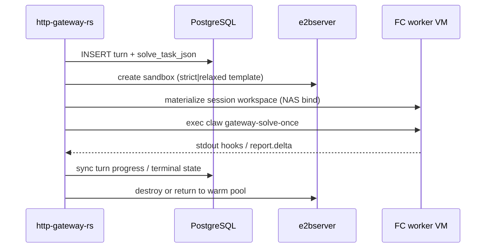

# HTTP Gateway：FC worker 编排

面向 **`http-gateway-rs`**：每次 solve / interactive 在 **e2b（FC）MicroVM** 内执行 `claw`，与网关进程隔离。网关负责 HTTP、队列、PG 物化/回写、经 **E2B-compatible API** 租还 sandbox。

Author: kejiqing

**运维入口：** `deploy/stack/README.md` + `docs/local-dev.md`。本文偏设计与 env 契约。

---

## 1. 三个角色

| 角色 | 代码 / 部署 | 职责 |
|------|-------------|------|
| **Gateway** | `rust/crates/http-gateway-rs/` | Axum API、`FcOrchestratedPool` 编排、NAS 经 claw-nas-api singleton |
| **e2bserver** | 自托管或阿里云 FC API | 创建/销毁 MicroVM、host bind NAS、`fc_exec.py` 远程 exec |
| **Worker 模板** | `deploy/fc-sandbox/build-claw-worker-*.py` | `claw-worker-strict` / `claw-worker-relaxed` 镜像层 |

**无** 宿主机 `:9944` pool daemon；**无** `SandboxRpcClient` / `claw-sandbox` 二进制。

---

## 2. 一次 solve 的路径

续聊制品在 **PostgreSQL**（`gateway_turns` + workspace tar）；worker 内路径经 NAS host bind，见 [`fc-nas-workspace.md`](fc-nas-workspace.md)。

---

## 3. 关键环境变量

| 变量 | 说明 |
|------|------|
| `CLAW_INTERACTIVE_BACKEND` | **必须** `fc` |
| `CLAW_SOLVE_ISOLATION` | **必须** `fc`（`env-profile.sh` 默认） |
| `CLAW_FC_API_URL` / `CLAW_E2B_SANDBOX_URL` | e2b API 基址（如 `http://10.8.0.1:3000`） |
| `CLAW_FC_API_KEY` / `ALIYUN_E2B_TOKEN` | API 密钥 |
| `CLAW_FC_WORKER_STRICT_TEMPLATE` | strict worker 模板 id |
| `CLAW_FC_WORKER_RELAXED_TEMPLATE` | relaxed（需 `CLAW_ALLOW_RELAXED_WORKER=1`） |
| `CLAW_NAS_*` | NAS export 与 gateway 侧路径；**禁止** gateway 直接 bind NAS |
| `CLAW_CLUSTER_ID` | PG 行级隔离 |

完整清单：`docs/env-config.md`；自托管模板：`deploy/stack/env.selfhosted-e2b.example`。

---

## 4. Rust 模块地图

| 路径 | 作用 |
|------|------|
| `pool/fc_orchestrated_pool.rs` | solve 租还 FC worker |
| `pool/interactive_backend/fc_*.rs` | terminal / agent / OVS / NAS API singleton |
| `pool/session_db_sync.rs` | PG ↔ guest 路径物化 |
| `solve_pool.rs` | solve 队列与 `PoolClients` 入口 |
| `claw-fc-sandbox-client/` | E2B REST 客户端 |

`claw_pool` 表与 `/v1/pools` API **保留**（历史 JOIN、Admin 展示），**不**用于挑选 RPC 目标。

---

## 5. Interactive / OVS

与 solve 共用 `CLAW_INTERACTIVE_BACKEND=fc`：

- **OVS：** `claw-ovs` singleton（`CLAW_OVS_BACKEND=fc`）
- **Observe tap：** `claw-observe` singleton
- **NAS 写盘：** `claw-nas-api` singleton

设计细节：`docs/ovs-chat/FC-OVS-SINGLETON-DESIGN.md`、`deploy/fc-sandbox/README.md`。

---

## 6. 已移除（勿再引用）

| 项 | 状态 |
|----|------|
| `claw-sandbox` / `sandbox/` workspace | 已删除 |
| `CLAW_SANDBOX_URL` / `CLAW_POOL_HTTP_BASE` | 无消费者 |
| `pool-daemon-up.sh` / `host-pool-daemon.md` | 已删除 |
| `podman_pool` / `docker_pool` | 已删除 |
| `gateway.sh pool-up` / `bench` / `stable-dev-up` | 显式报错 |

历史容器池设计见 git 历史或 `sandbox/docs/system-design.md`（归档）。

---

## 7. See also

- [`architecture-governance.md`](architecture-governance.md)
- [`live-report-contract.md`](live-report-contract.md)
- [`pool-registry.md`](pool-registry.md) — `claw_pool` 表语义（兼容层）
- [`http-gateway-k8s-pool.md`](http-gateway-k8s-pool.md) — K8s 映射思路（概念仍适用「外部队列 + exec」）
