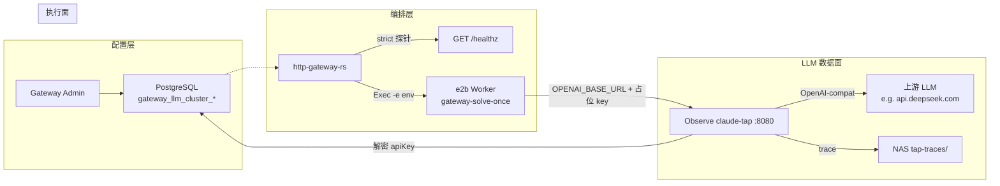

# LLM 使用层架构（Gateway / Observe Tap / Worker）

Author: kejiqing  
Status: **active** — e2b-only 生产路径  
Related: [`ovs-chat/FC-TAP-SINGLETON-DESIGN.md`](ovs-chat/FC-TAP-SINGLETON-DESIGN.md)、[`claw-tap-integration-requirements.md`](claw-tap-integration-requirements.md)、[`claw-tap-cluster-identity.md`](claw-tap-cluster-identity.md)

---

## 1. 一句话

**Admin 在 Gateway 写入 LLM 配置（加密落 PG）；不可信 Worker 只连 Observe Tap、只带占位 key；Tap 从 PG 解密真实凭证并代理上游；Gateway 只做编排与门禁，不把 apiKey 经 Worker 数据面传递。**

---

## 2. 「使用层」指什么

本文档的 **使用层** = 一次 solve / interactive turn 里，**LLM 请求从配置到上游** 的运行时链路，不涉及模型训练或 Admin UI 实现细节。

| 层 | 组件 | 职责 |
|----|------|------|
| **配置层** | Gateway Admin + PG | 录入 `baseModelUrl` / `modelName` / `apiKey`；按 `CLAW_CLUSTER_ID` 加密存储；选定 active model |
| **编排层** | `http-gateway-rs` | `/readyz` 门禁（tap strict）；组装 solve task；向 Worker **注入 env**（不写落盘 env 文件） |
| **LLM 数据面** | Observe 内 `claude-tap :8080` | OpenAI 兼容代理；读 PG active LLM；写 `tap-traces/`；**应**向上游注入真实 `Authorization` |
| **执行面** | e2b Worker | 跑 `gateway-solve-once` / 工具；**不**持有真实 apiKey、**不**挂 `CLAW_GATEWAY_DATABASE_URL`、**不**写 tap trace |

边界原则见 [`boundaries-claw-stack.md`](boundaries-claw-stack.md) § claude-tap。

---

## 3. 拓扑（生产：e2bObserveTap）



**比例关系：** `1 Gateway : 1 Observe : 1 OVS : N Workers`（见 [`FC-TAP-SINGLETON-DESIGN.md`](ovs-chat/FC-TAP-SINGLETON-DESIGN.md)）。

---

## 4. 凭证契约（核心）

### 4.1 设计意图

| 断言 | 说明 |
|------|------|
| Worker **永不**持有真实 apiKey | 不可信代码环境；避免 key 落盘、被 Landlock 外泄或 trace 泄露 |
| Tap **持有** PG 连接 + 解密能力 | 仅 Observe 单例进程配置 `CLAW_GATEWAY_DATABASE_URL` |
| Worker→Tap 的 `Authorization` **仅为占位** | 常量 `claw-tap-cluster`（见 `e2b_worker_tap.rs`） |
| Tap→Upstream **必须**用 PG 解密 key | **不得**把 Worker 传入的 `Authorization` 原样转发给上游 |

### 4.2 Worker 注入 env（e2b 路径）

来源：`rust/crates/http-gateway-rs/src/pool/interactive_backend/e2b_worker_tap.rs`

| 变量 | 值 | 说明 |
|------|-----|------|
| `OPENAI_BASE_URL` | `clawTap.proxyBaseUrl` | 例：`http://8080-sbx_xxx.supone.top` |
| `INTERNAL_CLAUDE_TAP_HOST` | 同上 | 与 base URL 一致 |
| `OPENAI_API_KEY` | `claw-tap-cluster` | **占位**；不是 DeepSeek/OpenAI 真实 key |
| `CLAW_DEFAULT_MODEL` | Admin active `modelName` | 例：`deepseek-v4-pro` |
| `CLAW_GATEWAY_DATABASE_URL` | **不注入** | 仅 Observe |

`solve` 任务元数据 `llmRoute.mode` = `e2bObserveTap`（审计用，见 session 下 `gateway-solve-task.json`）。

### 4.3 Observe 进程 env

来源：`deploy/e2b/e2b-tap-live-up.py` 创建 sandbox 时写入

| 变量 | 说明 |
|------|------|
| `CLAW_CLUSTER_ID` | 与 Gateway `.env` 一致（如 `local-dev`） |
| `CLAW_GATEWAY_DATABASE_URL` | 与 Gateway 同一 logical 库（user + dbname 一致即可 hash 对齐） |

### 4.4 Tap 对上游的请求头（**契约，待 claude-tap 完整实现**）

Worker 请求 Tap 时携带：

```http
Authorization: Bearer claw-tap-cluster
claw-session-id: <session_id>
```

Tap 转发上游时 **应**变为：

```http
Authorization: Bearer <PG 解密后的 sk-...>
```

并 **丢弃** Worker 占位 `Authorization` / `x-api-key`。

> **实现缺口（2026-06-30 联调确认）：** `claude-tap` v0.0.10 已从 PG 解密 `api_key`（`gateway_llm.py`），但 `proxy.py` 仍 `filter_headers(request.headers)` 透传客户端 `Authorization`，导致上游收到 `claw-tap-cluster` 尾号 `ster` 而 401。修复归属 **claude-tap 仓库**，非 gateway / worker 兜底。

---

## 5. PG 中的 LLM 配置与加密

### 5.1 表（按 cluster）

| 表 | 内容 |
|----|------|
| `gateway_llm_cluster_state` | `active_model_id` / `active_model_rev` |
| `gateway_llm_cluster_revision` | 某 revision 的 `base_model_url`、`model_name` |
| `gateway_llm_cluster_model` | 当前 model 行 + **`api_key_ciphertext`** |

实现：`rust/crates/http-gateway-rs/src/gateway_llm_cluster_store.rs`

### 5.2 apiKey 加密

- 算法：**AES-256-GCM**
- 密钥：`SHA256(CLAW_CLUSTER_ID)`（32 字节）
- 存储：`hex(nonce_12_bytes || ciphertext)` → 列 `api_key_ciphertext`
- Gateway 内存加载时解密；Admin API **不回显**明文（仅 `apiKeySet: true`）

Tap 侧须实现 **相同**解密（`claude_tap/gateway_llm.py::decrypt_llm_api_key`）。

### 5.3 配置真源 vs 探测路径

| 路径 | 是否经 Tap | 用途 |
|------|------------|------|
| **Solve / Worker LLM** | **是** | 生产流量 |
| **Admin `POST .../llm-models/test`** | **否** | Gateway 进程直连上游验证 PG 解密与模型名；**不能**代替 Tap 联调 |

因此：**Gateway probe 成功 + Tap 代理 401** 可同时成立——分别验证配置层与数据面。

---

## 6. 两条 solve 路由模式

Gateway 在 `solve_pool.rs` 按 pool 分支：

| 条件 | `llmRoute.mode` | Worker `OPENAI_API_KEY` | 说明 |
|------|-----------------|-------------------------|------|
| `pool_id == e2b`（生产） | `e2bObserveTap` | `claw-tap-cluster`（占位） | Tap 必须从 PG 注入 key |
| 其他 pool（本地 compose 等） | `clawTap` | **真实 key**（Gateway 解密后 `-e` 注入） | 信任本地 Worker；非 e2b 不可信路径 |

**e2b-only 部署只应走第一行。** 第二行保留给本地 sidecar tap 联调，不得作为生产 Worker 凭证模型。

---

## 7. Gateway 门禁（无降级）

| 检查 | 失败后果 |
|------|----------|
| `clawTap` 未配置 / `proxyBaseUrl` 空 | solve 不可用 |
| Tap `/healthz` `clusterId` / `clusterHash` 与 Gateway 不一致 | `cluster_mismatch`，**禁止 solve** |
| 无 active LLM | 503 |
| e2b Worker 创建 | **不**起本地 tap、**不**挂 `tap-traces` |

无「tap 挂了就让 Worker 直连 upstream」路径。见 [`claw-tap-integration-requirements.md`](claw-tap-integration-requirements.md) §1。

---

## 8. 运维命令

| 操作 | 命令 |
|------|------|
| 确保 Observe 单例 + 写 PG `clawTap` URL | `./deploy/stack/gateway.sh observe-tap-up` |
| 强制换新 Observe sandbox | `./deploy/stack/gateway.sh observe-tap-up --reset` |
| 重建 `claw-observe` 模板（缺 `startCmd` 时） | `python3 deploy/e2b/build-claw-observe-selfhosted.py` |
| 同步 traffic hosts（sandbox id 变更后） | `./deploy/stack/lib/e2b-traffic-hosts-sync.sh` |
| 验证 Gateway 直连 LLM（不经 Tap） | `POST /v1/gateway/global-settings/llm-models/test` |
| 验证 Tap 代理 | `curl -X POST http://8080-sbx_xxx.../chat/completions` + 占位 `Authorization: Bearer claw-tap-cluster` |

**注意：** 仅重建 Observe **不能**修复 Tap 未注入 key 的实现 bug；需发布新 `claude-tap` 镜像 → 重建 `claw-observe` 模板 → `observe-tap-up --reset`。

---

## 9. 验收清单

### 9.1 配置层

- [ ] Admin active LLM：`baseModelUrl`、`modelName`、`apiKeySet=true`
- [ ] `POST .../llm-models/test` 返回 `ok: true`（Gateway 直连上游）

### 9.2 Tap 集群身份

- [ ] `curl http://8080-sbx_xxx.../healthz` → `ok`、`clusterId`、`clusterHash` 与 Gateway 一致
- [ ] `GET /v1/gateway/global-settings` → `clawTap.proxyBaseUrl` 指向当前 Observe

### 9.3 LLM 数据面（修复后必过）

- [ ] Tap 代理 probe（占位 key）上游 **2xx**，非 `401 ... ****ster`
- [ ] `tap-traces/sessions/<id>/trace.jsonl` 中 `upstream_base_url` 正确；上游响应成功
- [ ] strict solve：`bootstrap_system_prompt_loaded` 后出现 `llm_stream_started`，无 `Permission denied` / 401

### 9.4 Worker 边界

- [ ] Worker env 无 `CLAW_GATEWAY_DATABASE_URL`
- [ ] Worker `OPENAI_API_KEY` 为 `claw-tap-cluster`
- [ ] Worker 不挂载 NAS `tap-traces` 写路径

---

## 10. 排障速查

| 现象 | 先查 | 常见根因 |
|------|------|----------|
| solve 401 / `api key ****ster invalid` | Tap trace + Worker env | Tap 透传占位 key，未注入 PG key（claude-tap bug） |
| Gateway probe 成功，Tap 失败 | 分别测 §9.1 与 §9.3 | 配置层正常、数据面未实现注入 |
| `Permission denied` load system prompt | Worker timing / Landlock | Worker 镜像或 prompt discovery（与 Tap 无关） |
| `gateway-solve-once timed out` | `solve-timing-events.ndjson` | 上游 LLM 慢或 401 重试 |
| `observe-tap-up` 400 missing startCmd | e2b 模板 | 跑 `build-claw-observe-selfhosted.py` 后重试 |
| `cluster_mismatch` | Gateway vs Tap `/healthz` | `CLAW_CLUSTER_ID` 或 PG URL user/dbname 不一致 |

证据文件（NAS）：

- `local-dev/proj_<id>/sessions/<request_id>/.claw/solve-timing-events.ndjson`
- `tap-traces/sessions/<request_id>/trace.jsonl`
- `gateway-solve-task.json` 内 `llmRoute`

---

## 11. 代码索引

| 主题 | 路径 |
|------|------|
| e2b Worker 占位 key | `rust/crates/http-gateway-rs/src/pool/interactive_backend/e2b_worker_tap.rs` |
| 本地 pool 真实 key 注入 | `rust/crates/http-gateway-rs/src/claw_tap_cluster_state.rs` (`resolve_solve_llm_route`) |
| solve pool 分支 | `rust/crates/http-gateway-rs/src/solve_pool.rs` |
| apiKey 加解密 | `rust/crates/http-gateway-rs/src/gateway_llm_cluster_store.rs` |
| Admin LLM 直连 probe | `rust/crates/http-gateway-rs/src/llm_probe.rs` |
| Observe 模板 / startCmd | `deploy/e2b/build-claw-observe-selfhosted.py` |
| Observe 单例生命周期 | `deploy/e2b/e2b-tap-live-up.py` |
| Tap 对接要求 | `docs/claw-tap-integration-requirements.md` |
| Tap 侧 PG 读取（外部仓） | `claude-tap/claude_tap/gateway_llm.py`、`gateway_upstream.py`、`proxy.py` |

---

## 12. claude-tap 待修项（给新对话）

在 **claude-tap** 仓库完成（不在 claw-code worker/gateway 兜底）：

1. **Cluster / PG 模式**：`proxy.py`（及 WS 路径）在转发前，用 `GatewayLlmUpstreamStore.runtime.api_key` 设置上游 `Authorization: Bearer <key>`，**移除** inbound 占位 header。
2. **Poll 热更新**：`reload_from_db` 时 apiKey 变更也应生效（不仅 `base_model_url` 变更打 log）。
3. **单测**：占位 `claw-tap-cluster` 入站 → 断言出站 header 为 PG 解密 key（mock PG）。
4. **发布**：新镜像 tag → `CLAUDE_TAP_IMAGE` → 重建 `claw-observe` → `observe-tap-up --reset` → §9.3 验收。
