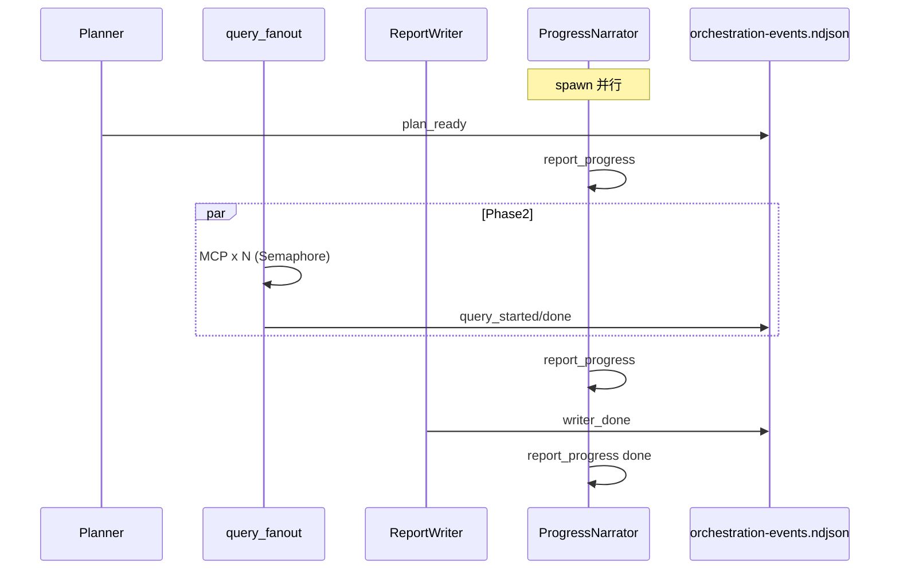

# Multi-agent 经营分析分阶段编排

Author: kejiqing

## 目标

将典型复杂经营分析从单 turn ~5min 压到 ~2min（P50 墙钟 &lt; 120s），并在 ~20s 内展示可审阅分析大纲（`planTitle` + `todos`）。

管道：**Planner → 并行 SQLBot 问数（零 LLM）→ ReportWriter**，并行 **ProgressNarrator** 负责唯一对用户的过程文案。

## 真相源

| 层 | 位置 |
| --- | --- |
| **DB** | `project_config.solve_orchestration_json`（PostgreSQL） |
| **物化** | `ds_<id>/home/.claw/solve-orchestration.json` |
| **运行时** | `gateway-solve-once` → `run_gateway_solve_turn` 读 kind 分支 |
| **Pool 挂载** | `solve-orchestration.json` ro 挂入 worker（同 preflight） |

与 `solve_preflight_json` 对称：**不**塞进 preflight 字段。

## Admin API

`GET` / `PUT /v1/project/config/{ds_id}` 字段 **`solveOrchestrationJson`**（camelCase）：

```json
{
  "kind": "multi_agent_analysis",
  "plannerMaxIter": 2,
  "writerMaxIter": 3,
  "queryConcurrency": 6,
  "narratorModel": null,
  "narratorThrottleMs": 3000
}
```

| `kind` | 行为 |
| --- | --- |
| `single_turn` | 默认；现有 `run_gateway_solve_turn` 单 turn 循环 |
| `multi_agent_analysis` | 分阶段编排（见下） |

缺省或未知 kind → `single_turn`。

## 阶段契约



### Phase1 Planner

- 1–2 次 LLM turn（`plannerMaxIter`）
- 工具：**仅** StructuredOutput；**无** `report_progress`、无 MCP
- 输出 JSON：`planTitle` + `todos[{id,title,question}]`
- 事件：`plan_ready`

### Phase2 Query fanout

- **零 LLM**：代码解析 plan，并发 MCP 问数
- **默认工具**：`tools/list` 的 `description` 含 **`parallel-friendly`**（SQLBot：`mcp_isolated_question_analysis`）  
  参数：`token` + `question` + `stream: false` + preflight 写入的 `datasource_id`（**无** 共享 `chat_id`）
- **工具选择**（优先级）：
  1. `solveOrchestrationJson.queryMcpTool`（qualified 或 raw 名，可选覆盖）
  2. 任意 `parallel-friendly` 描述的工具
  3. `readOnlyHint` 标注（`toolAnnotations` 兜底，见 `project-config-model.md`）
- **共享会话**旧路径（`mcp_question_then_analysis`）：`token` + `chat_id` + `question`；勿用于并行 fanout
- Preflight 须在 transcript 留下 `mcp_start`（token）及 `datasource_id for query tools: <id>` 注记
- 并发：仅 `CLAW_MCP_MAX_CONCURRENT`（物化 JSON 的 `queryConcurrency` 同步该 env）
- 结果压缩落盘：`home/.claw/analysis-results/{todoId}.json`
- 事件：`query_started` / `query_done` / `query_failed`

### Phase3 ReportWriter

- 1–3 次 LLM turn（`writerMaxIter`）
- 输入：plan + 压缩摘要；**禁止** MCP、`report_progress`
- 产出：最终 markdown 报告

### ProgressNarrator（并行 lane）

- spawn 于 solve 开始，与主阶段重叠（不占关键路径墙钟）
- 读 `home/.claw/orchestration-events.ndjson`
- **唯一**持有 `report_progress` 工具
- 节流：`narratorThrottleMs`（默认 3000ms）
- 可选更快模型：`narratorModel`
- Prompt：`home/.claw/phases/narrator.md`（缺省用内置默认）

## 进度与 API

`report_progress` 写入 `home/.claw/task-progress.json`：

- `planTitle`
- `todos[{id,title,status}]`（`pending` | `in_progress` | `done` | `skipped`）
- `currentTaskDesc`、`phase`

Gateway **`GET /v1/tasks/{task_id}`** 响应增加 `planTitle`、`todos`（从 task-progress 读取）。

Admin `ChatTurnCard` 展示分析大纲 checklist。

## 耗时观测

每轮 solve 落盘 `home/.claw/multi-agent-timings.json`：

```json
{
  "phases": [
    { "phase": "planner", "startedAtMs": 0, "endedAtMs": 22000 },
    { "phase": "query_fanout", "startedAtMs": 22000, "endedAtMs": 62000 },
    { "phase": "writer", "startedAtMs": 62000, "endedAtMs": 98000 }
  ]
}
```

日志：`claw_gateway_orchestration` + `orchestration=multi_agent phase=...`。

## 验收（P50 &lt; 120s）

固定门店 + 固定问题集，对比 `single_turn` vs `multi_agent_analysis`：

```bash
# 需 gateway 已启动、ds 已配置 multi_agent_analysis + sqlbot preflight
./scripts/benchmark-multi-agent.sh \
  --gateway http://127.0.0.1:8080 \
  --ds-id 1 \
  --prompt-file scripts/fixtures/multi-agent-benchmark-prompt.txt
```

脚本输出各次墙钟与 P50；目标 **P50 ≤ 120s**（10 子问题 × 并发 6 典型场景）。

## 部署调参

| 变量 | 建议（multi_agent） |
| --- | --- |
| `CLAW_MCP_MAX_CONCURRENT` | 12（问数并发唯一控制） |
| `CLAW_MCP_TOOL_CALL_TIMEOUT_MS` | 120000 |
| `plannerMaxIter` / `writerMaxIter` | 2 / 3 |

## 相关文档

- [`docs/project-config-model.md`](project-config-model.md) — DB 列说明
- [`docs/gateway-solve-preflight.md`](gateway-solve-preflight.md) — 首轮 SQLBot preflight（可与 multi_agent 叠加）
