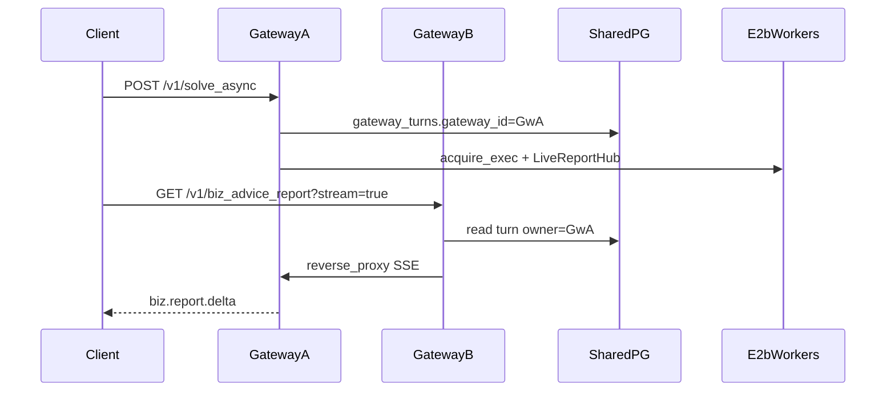

# 多 Gateway 同 clusterId 部署

Author: kejiqing

同一 `CLAW_CLUSTER_ID`、共享 PostgreSQL 的多台 gateway 入口部署契约。Admin **仍按 cluster 组织**，**不按 gateway 筛选**会话/项目。

---

## 拓扑



---

## Gateway 入口注册（`gateway_endpoint`）

| 列 / 字段 | 含义 |
|-----------|------|
| `gateway_id` | 稳定 ID（`CLAW_GATEWAY_ID`，默认 `gw-{hostname}`） |
| `gateway_base` | 浏览器/机间可达 URL（`CLAW_GATEWAY_BASE` 或 `CLAW_POOL_ADVERTISE_HOST` + `GATEWAY_HOST_PORT`） |
| `last_heartbeat_ms` | 后台约 30s 刷新；90s 内视为 **online** |

| API | 说明 |
|-----|------|
| `GET /v1/gateway/endpoints` | 本 cluster 清单 + `online` + `self` |
| `DELETE /v1/gateway/endpoints/{id}` | 删僵尸行（不可删本机 running 进程） |

**不**复活 pool-daemon / `claw_pool_join` 主路径；`claw_pool` 仅历史兼容，见 [`pool-registry.md`](pool-registry.md)。

---

## Turn 归属

`gateway_turns` 列：

- `gateway_id` / `gateway_base` — **入队写入**（接入 gateway）
- `pool_id` — 后端类型标记（e2b：`e2b-cloud`），**不再**用本机 `CLAW_POOL_ID` 冒充入口

API 回传：`gatewayId` / `gatewayBase`（`solve_async`、`GET /v1/tasks`、`GET …/turns`）。

---

## Live SSE / Cancel（owner 反代）

非 owner gateway 收到 running/queued 的 `GET /v1/biz_advice_report?stream=true` 或 cancel：

1. 读 turn `gateway_id` / `gateway_base`
2. owner **online** → **HTTP 反向代理**到 `{owner.gateway_base}/v1/...`（不用 302）
3. owner **offline** → 明确错误（**禁止**在错机建空 `LiveReportHub` 挂死）

Admin 客户端始终连**当前选中的** `gatewayBase`；错机由后端反代，上游无感。

---

## Worker 跨机互斥（e2b warm pool）

共享 e2b worker；仅在 reconcile/create/retire 上分布式互斥：

| 机制 | 说明 |
|------|------|
| `pg_advisory_lock(hash(cluster,proj,slot))` | create / rotate / retire / force_rotate 持锁再读行；已有 running → **adopt** |
| `project_e2b_worker.in_use_count` / `in_use_until_ms` | acquire +1/续期，release −1；`try_retire` 必须 `in_use_count==0` |
| warm worker metadata `clusterId` | orphan reap 仅本 cluster |

他机 in-use 时：startup/shrink/rotate/reset **defer 或 409**，禁止 kill。

---

## Cluster 单例（observe / nas-api）

同一 `(cluster_id, role)` 的 ensure/reset/reconcile 经 **PG advisory lock** 串行：

- 多 sandbox 同 role → 稳定规则选唯一 winner，persist 后 reap 其余
- `global settings` 更新用字段级 `jsonb_set` merge，禁止整包 RMW 覆盖

---

## 环境变量

| 变量 | 说明 |
|------|------|
| `CLAW_CLUSTER_ID` | 共享 PG 行级隔离 |
| `CLAW_GATEWAY_ID` | 入口 ID（可选，默认 `gw-{hostname}`） |
| `CLAW_GATEWAY_BASE` | 入口 URL（机间 SSE 反代必须互通） |

---

## 双机验收要点

1. 两机同 `CLAW_CLUSTER_ID` + 共享 PG → Admin「全局推理」可见两端 heartbeat **online**
2. A `solve_async`，B 订 live SSE → delta 正常（反代）
3. 双机同时 reconcile 同 proj slot → PG 仅一行，无长期 orphan
4. A 使用 worker 时，B 的 startup/shrink/rotate/reset **不得 kill** worker
5. 双机同时维护 observe/nas-api → 每 role 仅一实例；global settings 无丢字段
6. turn 卡片显示 **A 的 gateway**（非 Admin 当前选中 gateway）；无 gateway 筛选仍能看全集群会话

```bash
# 编译
cd rust && cargo check -p http-gateway-rs

# 每机
./deploy/stack/gateway.sh pack-deploy local
curl -s "$GATEWAY_BASE/v1/gateway/endpoints" | jq .
```
