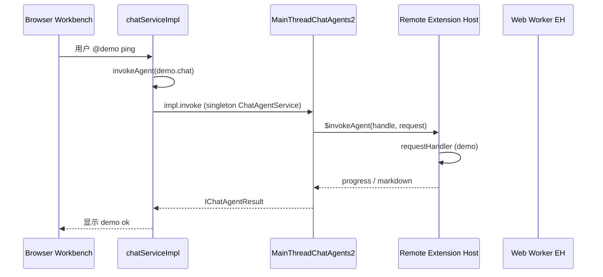

# OVS Chat Participant 源码修复 — 工程交接文档

Author: kejiqing  
Date: 2026-06-18  
用途：**新开独立工程**修 openvscode-server / VS Code Chat 派发链；本文是自洽交接包，不依赖聊天上下文。

关联仓库：`claw-code`（本仓仅保留 demo 扩展、部署脚手架、验证脚本；**不在此仓改 vscode 源码**）。

---

## 1. 一句话结论

**阻塞点：** OVS 1.105.1 Web 环境下，Chat participant 能 `createChatParticipant` / `$registerAgent`，但 **`$invokeAgent` 未调到扩展 `requestHandler`**，UI 卡在 **Working**，看不到回复。

**不是 demo 写错：** `extensions/ovs-chat-demo` 在 Desktop/Remote SSH 模式应能工作；问题在 **OVS 浏览器工作台 ↔ Extension Host 的 Chat RPC 路由**。

**上游状态：** [microsoft/vscode#262604](https://github.com/microsoft/vscode/issues/262604)（Web extension + Chat participant）截至 2026-02 **仍 open**；openvscode-server 上游已发布 **1.109.5**，本仓仍 pin **1.105.1**，**未验证**升级是否修复。

---

## 2. 产品边界（claw-code 内）

| 路由 | 状态 | 说明 |
|------|------|------|
| `/coding` | 不动 | ttyd + claw CLI |
| `/ovs?projId=N` | 并列新产品面 | OVS Web IDE + Chat（依赖本修复） |
| Playground 代理 | 已通 | `web/gateway-async-playground/server.py` → `/ovs`、`/ovs/agent/ws` |

**修复完成前：** 不要接 `extensions/claw-vscode` 的 gateway WS；先用 **`ovs-chat-demo`** 打通 `@demo` → `demo ok`。

---

## 3. 本仓提供的资产（可拷贝到新工程）

### 3.1 最小复现扩展

路径：`extensions/ovs-chat-demo/`（当前 **0.2.0**）

- Participant id：`demo.chat`，`@demo`
- Remote EH only：`extensionKind: ["workspace"]`，`main: ./extension.js`
- `isDefault: true` + `enabledApiProposals: ["defaultChatParticipant"]`
- 诊断：Output Channel **`OVS Chat Demo`**
  - 期望见：`activate()`、`createChatParticipant ok`
  - **成功标准：** `handler prompt="..."` 且 Chat 显示 **`demo ok`**

### 3.2 部署与验证（claw-code 根目录）

```bash
# 构建 OVS 镜像（含 demo VSIX）
CLAW_FORCE_REBUILD_OVS=1 ./deploy/stack/gateway.sh build

# 启动（仅 OVS）
podman compose -f deploy/stack/podman-compose.yml up -d openvscode-server

# 冒烟：扩展已装 + HTTP 200
./deploy/stack/lib/verify-ovs-chat-demo.sh
```

手动 E2E：

1. 打开 `http://127.0.0.1:13000/ovs/?folder=/home/workspace/proj_2/home`
2. 若出现 Trust 对话框 → 信任 workspace
3. Chat → `@demo ping` → Enter
4. 打开 Output → **OVS Chat Demo**

### 3.3 关键配置（已验证组合）

**Machine settings：** `deploy/stack/openvscode-settings.json`

```json
{
  "chat.experimental.serverlessWebEnabled": false,
  "chat.experimental.disableCoreAgents": true,
  "chat.agent.enabled": true,
  "chat.newSession.defaultMode": "ask"
}
```

**OVS 启动参数：** `deploy/stack/Containerfile.openvscode` + `podman-compose.yml`

```
--extensions-dir=/opt/claw-extensions
--server-data-dir=/opt/claw-ovs/server-data
--enable-proposed-api=claw.ovs-chat-demo
```

**Compose 环境：** `HOME=/opt/claw-ovs/home`（避免扩展落到 workspace bind mount 空目录）

**镜像 pin：** `deploy/stack/lib/build.sh` → `gitpod/openvscode-server:1.105.1`（`docker.1ms.run` 镜像）

---

## 4. 架构与双 Extension Host



OVS 实际运行时 **同时存在**：

- **Remote EH**（Node）：`--extensions-dir` 安装的 VSIX，`127.0.0.1:13000 - Installed`
- **Web Worker EH**（iframe）：`Browser - Installed`（demo 未成功装入）

Console 常见：`The web worker extension host is started in a same-origin iframe!`

**假设（待新工程日志证实）：** Chat 派发目标 EH 与 `$registerAgent` 所在 EH 不一致，或 `$invokeAgent` RPC 挂起/失败但未 surfacing 到 UI。

---

## 5. VS Code 源码调用链（修 bug 的插入点）

基于 **vscode 1.105.1** 标签，fork `gitpod/openvscode-server` 后改同名路径。

| 顺序 | 文件 | 关注点 |
|------|------|--------|
| 1 | `src/vs/workbench/contrib/chat/common/chatServiceImpl.ts` | `invokeAgent`；发送 `@demo` 时是否进入 |
| 2 | `src/vs/workbench/contrib/chat/common/chatAgents.ts` | `registerAgentImplementation` / `getActivatedAgents`；`impl` 是否存在 |
| 3 | `src/vs/workbench/api/browser/mainThreadChatAgents2.ts` | `$registerAgent`；`impl.invoke` → `this._proxy.$invokeAgent` |
| 4 | `src/vs/workbench/api/common/extHostChatAgents2.ts` | `$invokeAgent` → `agent.invoke` → `requestHandler` |
| 5 | `src/vs/workbench/services/extensions/common/extensionRunningLocationTracker.ts` | `pickExtensionHostKind`；`extensionKind` 顺序决定 Remote vs Worker |
| 6 | `src/vs/workbench/services/extensions/browser/extensionService.ts` | Web 端扩展加载；remote 扩展是否 mirror 到 worker |

**GitHub 直链（1.105.1）：**

- [mainThreadChatAgents2.ts](https://github.com/microsoft/vscode/blob/1.105.1/src/vs/workbench/api/browser/mainThreadChatAgents2.ts) — `$registerAgent` 内 `impl.invoke` 调 `$invokeAgent`
- [extHostChatAgents2.ts](https://github.com/microsoft/vscode/blob/1.105.1/src/vs/workbench/api/common/extHostChatAgents2.ts) — `$invokeAgent`、`createChatAgent`

**建议日志格式（四处同时加，带 `requestId` / `agentId` / `handle` / EH kind）：**

```typescript
this._logService.info(`[OVS-CHAT] mainThread invoke agentId=${id} requestId=${request.requestId}`);
```

---

## 6. 实测证据链（2026-06-18，OVS 1.105.1）

| 观测 | 证据 | 结论 |
|------|------|------|
| 扩展安装 | `verify-ovs-chat-demo.sh` OK；`claw.ovs-chat-demo` 在 `/opt/claw-extensions` | ✅ |
| Remote EH 激活 | `remoteexthost.log`: `onChatParticipant:demo.chat` 或 `onStartupFinished` | ✅ |
| 运行时注册 | Output: `createChatParticipant ok` | ✅ |
| Handler 执行 | Output **无** `handler prompt=...` | ❌ |
| UI | `@demo ping` → **Working** 不结束；`document.body` 无 `demo ok` | ❌ |
| New Chat | `isDefault` + `--enable-proposed-api` 后可用；无 `isDefault` 时报 `No default agent contributed` | 会话初始化依赖 default agent |
| Browser EH | Extensions → **Browser - Installed: 空**；**Install in Browser** → `not compatible` | serverless / 双 EH 路径未打通 |
| ESM browser 入口 | `import * as vscode` → `Cannot use import statement outside a module` | Web worker 要 **CommonJS** `require` |
| 上游 bug | [#262604](https://github.com/microsoft/vscode/issues/262604) open | 官方未闭合 |

**重要：** UI 的 **Working** 来自 `acceptRequest()` 的 progress 动画（约 4s），**不能**当作 handler 已执行。

---

## 7. 已证伪方案（新工程勿重复）

| # | 做法 | 结果 |
|---|------|------|
| 1 | `openvscode-product-patch.json` 假 `defaultChatAgent` → claw | Copilot setup，`reading 'response'` |
| 2 | `--install-builtin-extension` 双路径安装 | Extensions UI 异常；EH 行为不一致 |
| 3 | `--enable-proposed-api` 在扩展扫描前、扩展未就绪 | `Unknown extension`，EH 60s 超时 |
| 4 | 仅 Remote `main` + `serverlessWebEnabled: true` 无 Browser 安装 | UI 有 participant，handler 不调 |
| 5 | `extensionKind: ["workspace","web"]` 无 Browser 实际安装 | Install in Browser 不出现或失败 |
| 6 | `extensionKind: ["web"]` + ESM `browser/extension.js` | Install in Browser → **not compatible** |
| 7 | 升到 1.109.5 | **本仓未测**；#262604 仍 open，不能假设已修 |

---

## 8. 新工程建议结构

```
ovs-chat-fix/                    # 新仓库
├── openvscode-server/           # git submodule 或 fork
│   └── (vscode 子树，在此加日志/补丁)
├── extensions/
│   └── ovs-chat-demo/           # 从 claw-code 拷贝或 submodule
├── patches/
│   └── 0001-chat-eh-invoke.patch
├── Dockerfile                   # FROM 自建编译产物或 pin 版本
├── scripts/
│   ├── build-ovs.sh
│   └── verify-demo.sh           # 改编自 claw-code verify 脚本
└── README.md
```

### 8.1 起步命令

```bash
git clone https://github.com/gitpod-io/openvscode-server.git
cd openvscode-server
# 阅读官方 README：npm install / npm run server:web 或 release 构建

# 从 claw-code 拷贝 demo
cp -r /path/to/claw-code/extensions/ovs-chat-demo ./extensions-demo
./deploy/stack/lib/package-ovs-extension-vsix.sh extensions-demo /tmp/demo.vsix
# 安装到本地 OVS 实例后测 @demo
```

### 8.2 调试顺序

1. **只加日志**，确认断点层（§5 表 1→4）
2. 若断在 3→4：查 **ExtHost RPC proxy** 是否指向注册时的 EH
3. 若需 Browser EH：查 `extensionService.ts` + **Install in Browser** 兼容性（#141322、#168942）
4. 补丁稳定后：出 Docker 镜像 tag，回写 claw-code `CLAW_OVS_BASE_IMAGE`

### 8.3 成功标准（demo）

- [ ] Output：`handler prompt="ping"`（或等价）
- [ ] Chat 可见：**demo ok**
- [ ] `remoteexthost.log` 或 browser EH 日志有 `$invokeAgent` 痕迹
- [ ] 硬刷新 / 新 isolated browser context 可复现

### 8.4 成功后再接 claw-code

1. `Containerfile.openvscode` 换自建镜像
2. VSIX 从 `ovs-chat-demo` 换回 `claw-vscode`
3. 验证 `/ovs/agent/ws`（playground 代理 + gateway `session_agent_api.rs`）
4. 更新 `docs/boundaries-claw-stack.md`

---

## 9. 相关上游 Issue

| Issue | 主题 |
|-------|------|
| [#262604](https://github.com/microsoft/vscode/issues/262604) | Web extension + Chat participant handler 不调 |
| [#141322](https://github.com/microsoft/vscode/issues/141322) | Remote 扩展在 Web Worker EH 运行 |
| [#168942](https://github.com/microsoft/vscode/issues/168942) | vscode-remote: 扩展与 worker |
| [#222011](https://github.com/microsoft/vscode/issues/222011) | package.json participant 声明与激活 |

---

## 10. claw-code 内相关文件索引

| 路径 | 用途 |
|------|------|
| `extensions/ovs-chat-demo/` | 最小复现扩展 |
| `extensions/claw-vscode/` | 产品扩展（修复前勿主打） |
| `deploy/stack/Containerfile.openvscode` | OVS 镜像 |
| `deploy/stack/openvscode-settings.json` | Machine Chat 设置 |
| `deploy/stack/podman-compose.yml` | `openvscode-server` 服务 |
| `deploy/stack/lib/build.sh` | OVS 镜像 pin / 构建 |
| `deploy/stack/lib/verify-ovs-chat-demo.sh` | 安装冒烟 |
| `deploy/stack/lib/package-ovs-extension-vsix.sh` | VSIX 打包 |
| `web/gateway-async-playground/server.py` | `/ovs` 代理 |
| `docs/boundaries-claw-stack.md` | 栈边界 |
| `docs/ovs-chat-debug-log.md` | 简版时间线（指向本文） |

---

## 11. 日志抓取备忘

```bash
# Remote EH
podman exec claw-openvscode-server sh -c \
  'tail -f $(ls -t /opt/claw-ovs/server-data/data/logs/*/exthost*/remoteexthost.log | head -1)'

# Demo Output（在 OVS UI：View → Output → OVS Chat Demo）

# 浏览器 Console：Filter "OVS-CHAT" 或 "invokeAgent" 或 "Extension Host"
```

---

**维护约定：** 新工程有结论后，把 **断点层 + 补丁 PR 链接 + 验证命令输出** 回贴到 `docs/ovs-chat-debug-log.md` 顶部，便于 claw-code 接镜像。
