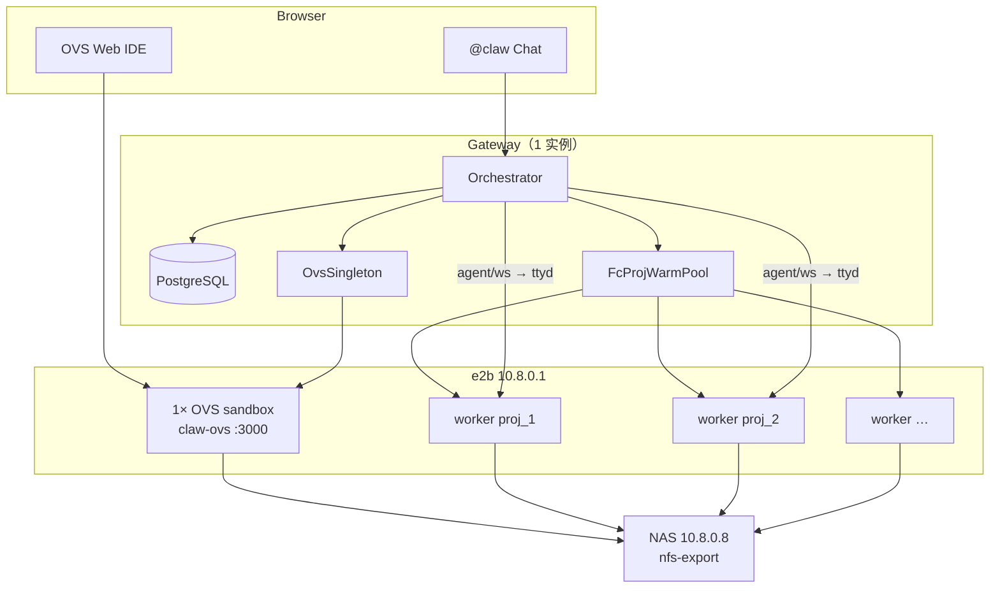

# e2b OVS Singleton — 1 Gateway : 1 OVS : N Workers

> **DEPRECATED (2026-07)**：OVS 已迁入 **relaxed worker 内置**（`claw-worker-relaxed`），不再使用独立 `ovs-singleton`。见 [RELAXED-WORKER-OVS.md](./RELAXED-WORKER-OVS.md) 与 [ACCEPTANCE.md](./ACCEPTANCE.md)。

Author: kejiqing  
Status: **superseded** — 历史设计文档，仅供追溯  
Related: [INTEGRATION.md](./INTEGRATION.md), [boundaries-claw-stack.md](../boundaries-claw-stack.md), `deploy/e2b/README.md`

---

## 1. 问题

| 现状 | 后果 |
|------|------|
| OVS 在 compose `openvscode-server` 容器 | Mac Podman **无法** compose NFS / bind `/mnt`（rootless + virtiofs + VM NAT） |
| Worker 交互已可走 e2b + NAS 沙箱内挂载 | OVS 与 worker **分裂**：编辑器在 compose，执行在 e2b |
| Gateway 仍 materialize 本地 `work_root`（fc 模式部分已跳过） | Mac 与 234 行为不一致，NAS 挂载策略三套并行 |

**目标：** 可持续、单一默认路径 —— **Gateway 只管 PG + 编排**；**文件真相在 NAS**；**OVS 与 worker 都在 e2b**；Mac 只跑 Gateway。

---

## 2. 核心模型

```text
1 × Gateway  ──1:1──►  1 × OVS (e2b, claw-ovs template)
                │
                └──1:N──►  N × Worker (e2b, claw-worker template, proj-bound warm pool)
```

| 不变量 | 说明 |
|--------|------|
| **1 Gateway : 1 OVS** | 按 `CLAW_CLUSTER_ID` 绑定；多 Gateway 不共享 OVS |
| **1 OVS : N Worker** | OVS 是 IDE hub；worker 按 proj 扩缩；**OVS 不进 worker template** |
| **NAS 唯一文件树** | OVS 挂 export **根**；worker 挂 `proj_N/home` + `proj_N/sessions/…` |
| **执行不经 OVS** | `@claw` → Gateway `/agent/ws` → **worker** ttyd（已有链路） |
| **compose 不跑 OVS** | `CLAW_OVS_BACKEND=e2b` 时跳过 `openvscode-server` |

---

## 3. 拓扑



### 3.1 Mac / 234 / 生产 — 同一逻辑

| 节点 | 跑什么 | 不跑什么 |
|------|--------|----------|
| **Mac dev** | Gateway + PG（+ 过渡期 solve pool 可选） | compose OVS、compose NAS volume |
| **234 ECS** | Gateway + PG + solve pool（过渡） | compose OVS（fc 模式） |
| **e2b** | 1 OVS + N worker | — |
| **NAS** | export 根 | — |

Mac 与 234 **同一 profile**（`selfhosted-e2b`）；差别只在 Gateway 宿主机是否还带 solve podman pool。

---

## 4. 组件职责

### 4.1 Gateway

- **PG**：sessions、turns、project_config（已有）
- **`OvsSingleton`**（新）：ensure / health / URL；进程内缓存 `FcSandboxHandle`
- **`FcProjWarmPool`**（已有）：per-`proj_id` worker 预热、bake、acquire、release
- **路由**：Playground、`GET …/ovs/workspace`、`/ovs/agent/ws`（已有 agent 桥）
- **不** materialize 本地 NAS 树（fc 全路径；OVS workspace API 只写 NAS 上 settings + 返回 URL）

### 4.2 OVS sandbox（`claw-ovs` template，单例）

- openvscode-server + claw-vscode VSIX（≈ 现有 `Containerfile.openvscode`）
- **无** claw / ttyd
- NAS：挂 **export 根** → 容器内 `/claw_ws`
- 启动参数：`--server-base-path=/ovs`（**勿**加 `--default-folder`；会吃掉 `?folder=/claw_ws/proj_N/home`，与 compose OVS 同 [INCIDENT-2026-06-18](./INCIDENT-2026-06-18.md)）
- 端口：**3000**（e2b host 前缀 `{port}-{sandboxId}.{domain}`）
- metadata：`clawRole=ovs-singleton`，`clusterId=${CLAW_CLUSTER_ID}`

### 4.3 Worker sandbox（`claw-worker` template，N 个）

- claw + ttyd + nfs-common（现有 `build-claw-worker-selfhosted.py`）
- **无** openvscode-server
- NAS：`proj_N/home` → `/claw_ds`；session → `/claw_host_root`（现有 `e2b_interactive_materialize.rs`）
- 端口：**7681**
- metadata：`clawRole=warm-proj`，`projId=N`

---

## 5. NAS 挂载契约（单路径）

**完整说明（唯一逻辑根、各组件本地路径、Mac podman machine 直 bind）：[`docs/e2b-nas-workspace.md`](../e2b-nas-workspace.md)**

```text
NAS export 根（逻辑路径）
    │
    ├─ Gateway：在 CLAW_NAS_HOST_MOUNT 上 mkdir / materialize
    │
    └─ e2b：hostMountRoot + relPath → mountDir（virtiofs bind）
```

| 层 | 职责 |
|----|------|
| **Gateway** | 逻辑路径 → 本机 NAS 目录（`proj_N/home`、`proj_N/sessions/{segment}`）；PG materialize |
| **e2b** | `{hostMountRoot}/{relPath}` bind → guest `mountDir`（不解析 Claw 语义） |

| 沙箱 | 逻辑 relPath | guest mountDir | 时机 |
|------|--------------|----------------|------|
| OVS / observe | ``（export 根） | `/claw_ws` | singleton create |
| Worker warm / fc-cloud solve | `proj_N/home` + `proj_N/workers/{workerId}` | `/claw_ds` + `/claw_host_root` | create + bake / per-turn |

**Session 路由（Gateway，不 bind 进沙箱）：** `proj_N/sessions/{segment}` → symlink `../workers/{workerId}`。见 [`e2b-nas-workspace.md`](../e2b-nas-workspace.md) §1。

**禁止：** sandbox 内 `mount.nfs4`（Firecracker 无 `CAP_SYS_ADMIN`）；`volumeMounts` / `CLAW_E2B_NAS_VOLUME_NAME` legacy 已移除。

代码：`claw-e2b-sandbox-client/src/nas_paths.rs`（逻辑映射）、`http-gateway-rs/src/pool/e2b_nas_layout.rs`（Gateway 本机路径）。

---

## 6. 生命周期

### 6.1 OVS Singleton 状态机

```text
                    Gateway 启动 / 首次需要 OVS
                              │
                              ▼
                    ┌─────────────────┐
              ┌────►│   RUNNING       │◄────┐
              │     │ (1 sandbox)     │     │ recreate on failure
              │     └────────┬────────┘     │
              │              │ health fail / timeout
              │              ▼
              │     ┌─────────────────┐
              └─────│   RECREATING    │
                    └─────────────────┘

Absent ──ensure──► RUNNING
```

**`ensure_singleton_ovs()`**（Gateway 内，伪代码）：

1. 内存已有 handle → HTTP GET `http://3000-{id}.{domain}/ovs/` 探活 → OK 则返回
2. 调 e2b `POST /sandboxes`：`templateID=claw-ovs`，`nasConfig` bind export 根 → `/claw_ws`
3. exec：启动 openvscode-server（nohup + pidfile）
4. 缓存 handle + `ovs_base_url`

**不池化、不 per-proj 复制。** 一个 Gateway 进程内全局一个实例（多副本 Gateway 部署时每个副本各 1 OVS —— 见 §11）。

### 6.2 Worker warm pool（已有，不变）

```text
ensure_warm(proj_id) → warm_one → nasConfig bind /claw_ds → bake
terminal_start(ovs-N) → acquire → Gateway mkdir session on NAS → bind /claw_host_root → ttyd
stop / release → session_release_sh（停 ttyd）→ 回 idle
```

OVS singleton **不参与** worker acquire/release。

---

## 7. 请求路径（与现网对齐）

### 7.1 打开 IDE

```text
Playground /ovs?projId=2
  → GET /v1/projects/2/ovs/workspace
  → ensure_singleton_ovs()
  → materialize proj_2/home on NAS（settings.json）
  → 302 / 返回 ovsUrl + workspaceFolder

Browser → {ovsUrl}/?folder=/claw_ws/proj_2/home
```

### 7.2 @claw Chat（不变）

```text
OVS 插件 → ws://gateway/…/agent/ws?projId=2
  → ensure_terminal_active(sessionId=ovs-2)
  → FcProjWarmPool.acquire(2)
  → terminal/ws 桥到 worker 7681
```

OVS 与 worker **不同沙箱**；通过 Gateway + 同 NAS 树保持一致。

---

## 8. API 变更

### 8.1 `GET /v1/projects/{proj_id}/ovs/workspace`

**现有字段**（保留）：

| 字段 | fc 模式下值 |
|------|-------------|
| `workspaceFolder` | `/claw_ws/proj_{id}/home` |
| `agentSessionId` | `ovs-{id}` |
| `hostPath` | NAS 相对路径说明（或 deprecate 为 `proj_{id}/home`） |

**新增**：

| 字段 | 说明 |
|------|------|
| `ovsUrl` | 如 `http://3000-{sandboxId}.10.8.0.9/ovs` |
| `ovsBackend` | `"fc"` \| `"compose"`（迁移期） |

### 8.2 Gateway 只读配置（可选）

`GET /v1/claw/ovs` — 返回当前 cluster 的 OVS base URL（Playground 启动时用）。

### 8.3 Playground

- `PLAYGROUND_OVS_BASE`：fc 模式下由 Gateway API 动态解析，**不再**写死 `openvscode-server:3000`
- `/ovs/agent/ws` 代理：**不变**（仍指 Gateway）

---

## 9. 环境契约

### 9.1 新增 / 变更变量

| 变量 | 默认 | 说明 |
|------|------|------|
| `CLAW_OVS_BACKEND` | `compose` | `fc` → e2b singleton；`compose` → 现有 compose（迁移期） |
| `CLAW_E2B_OVS_TEMPLATE` | `claw-ovs` | OVS 专用 template（≠ `CLAW_E2B_TEMPLATE`） |
| `CLAW_E2B_OVS_PORT` | `3000` | OVS 监听 / e2b 前缀端口 |
| `CLAW_OVS_MOUNT_ROOT` | `/claw_ws` | fc 模式 OVS 容器内根（API `workspaceFolder` 前缀） |
| `CLAW_E2B_OVS_SANDBOX_TIMEOUT_SECS` | 同 worker | singleton 超时；需续期或 recreate |

**不变：**

| 变量 | 说明 |
|------|------|
| `CLAW_INTERACTIVE_BACKEND=e2b` | worker 走 e2b |
| `CLAW_E2B_TEMPLATE=claw-worker` | 仅 worker |
| `CLAW_E2B_POOL_*` | worker 池 |
| `CLAW_E2B_NAS_*` / `NAS_BASE_URL` | NAS export 逻辑根（nasConfig `serverAddr` fallback） |
| `CLAW_NAS_HOST_MOUNT` | Gateway 本机 NAS 挂载点（mkdir / materialize） |
| `CLAW_USE_NAS_VOLUME=0` | Mac：**compose 不挂 NAS** |

### 9.2 Profile：`selfhosted-e2b`（推荐）

```bash
CLAW_CLUSTER_ID=local-dev
CLAW_INTERACTIVE_BACKEND=e2b
CLAW_OVS_BACKEND=e2b
CLAW_USE_NAS_VOLUME=0

NAS_BASE_URL=10.8.0.11
CLAW_E2B_NAS_SERVER=10.8.0.11
CLAW_E2B_NAS_EXPORT=/

CLAW_E2B_API_URL=http://10.8.0.1:3000
CLAW_E2B_SANDBOX_URL=http://10.8.0.1:3002
CLAW_E2B_DOMAIN=supone.top
CLAW_E2B_TEMPLATE=claw-worker
CLAW_E2B_OVS_TEMPLATE=claw-ovs
CLAW_E2B_POOL_MIN_IDLE=1
CLAW_E2B_POOL_SIZE_CAP=4
```

Mac compose：**gateway + pg + playground**；**无** `openvscode-server`。

---

## 10. Template 分工

模板构建必须使用 e2b 标准模式（SDK 上传 build context / `COPY`，或 `from_image`）。严禁临时 HTTP artifact server、`RUN curl http://host:port/...`、`dockerfile-http`、`CLAW_*_TEMPLATE_HTTP_*`。这类路径依赖本机临时端口和私有网络，不属于稳定模板构建契约。Author: kejiqing

| Template | Build 脚本 | 内容 |
|----------|------------|------|
| `claw-worker` | `deploy/e2b/build-claw-worker-selfhosted.py` | debian, nfs-common, claw, ttyd |
| `claw-ovs` | `deploy/e2b/build-claw-ovs-selfhosted.py`（**新建**） | passionke openvscode-server + VSIX + nfs-common |

**禁止** 把 OVS 二进制并入 `claw-worker` Dockerfile。

`claw-ovs` 启动脚本（sandbox 内，Gateway exec 注入）：

```bash
# NAS root → /claw_ws
# nohup openvscode-server --host 0.0.0.0 --port 3000 \
#   --without-connection-token --server-base-path=/ovs \
#   # no --default-folder (browser ?folder=proj_N/home)
#   --extensions-dir=/opt/claw-extensions \
#   --server-data-dir=/opt/claw-ovs/server-data \
#   --enable-proposed-api=claw.claw-vscode
```

---

## 11. 边界与非目标

### 11.1 本设计包含

- OVS singleton per Gateway（e2b）
- Worker warm pool per proj（已有）
- Mac / 234 统一 fc profile
- compose OVS 迁移开关 `CLAW_OVS_BACKEND`

### 11.2 非目标（后续单独立项）

| 项 | 说明 |
|----|------|
| solve → e2b | 仍 podman pool；见 `boundaries-claw-stack.md` |
| config revision / stale worker 驱逐 | warm pool 二期 |
| OVS Chat ↔ PG 双向 transcript 同步 | 产品未要求 |
| 多 Gateway 副本共享 1 OVS | **不做**；每副本各 ensure 1 OVS，或上层 sticky |
| Git 分支 → 独立 REPL | 见 [PLAN.md](./PLAN.md) 未实现节 |

### 11.3 Gateway 多副本

若同一 `CLAW_CLUSTER_ID` 水平扩 Gateway：

- **默认：** 每 Pod 各 `ensure_singleton_ovs()` → 每副本 1 OVS（简单，可能浪费）
- **可选二期：** PG 或 Redis 分布式锁 + 共享 `ovs_sandbox_id` 行

首版：**单 Gateway 实例**（Mac / 234 dev），不实现分布式锁。

---

## 12. 实施分期

| Phase | 交付 | 验收 |
|-------|------|------|
| **P0** | `build-claw-ovs-selfhosted.py` + 手动起 OVS sandbox + NAS + curl `/ovs/` | e2b 上 OVS 可开 folder |
| **P1** | `OvsSingleton` + `ensure_singleton_ovs` + workspace API 返回 `ovsUrl` | Mac Gateway only；浏览器开 proj |
| **P2** | `CLAW_OVS_BACKEND=e2b` compose 跳过 OVS；Playground 动态 base | `gateway.sh up` 无 openvscode-server |
| **P3** | `verify-e2b-ovs-e2e.sh` 改 fc 路径；文档 / `.env.example` | E2E green |
| **P4** | 234 切 profile；deprecate compose OVS | 生产同构 |

---

## 13. 代码触达面（实现清单）

| 区域 | 文件 / 动作 |
|------|-------------|
| 设计 | 本文 |
| OVS template | `deploy/e2b/build-claw-ovs-selfhosted.py` |
| e2b client | `claw-e2b-sandbox-client`: `create_ovs_singleton_sandbox()`, `ovs_public_host(port)` |
| Gateway | `session_ovs_api.rs`: `ovsUrl`, fc materialize on NAS |
| Gateway | `fc_ovs_singleton.rs`（新模块） |
| Gateway | `main.rs`: startup `ensure_singleton_ovs`（lazy 或 readyz 前） |
| Compose | `compose-include.sh`: `CLAW_OVS_BACKEND=e2b` → 不 merge OVS service |
| Playground | 读 `ovsUrl` / `/v1/claw/ovs` |
| Env | `env.selfhosted-e2b.example`, `boundaries-claw-stack.md` 表一行 |
| E2E | `verify-e2b-ovs-e2e.sh`, `verify-ovs-claw-e2e.sh` |

---

## 14. 待验证（无证据不下结论）

| # | 假设 | 验证命令 / 步骤 |
|---|------|-----------------|
| V1 | self-hosted e2b 暴露 **3000** 前缀端口 | 起 sandbox 后 `curl http://3000-{id}.10.8.0.9/ovs/` |
| V2 | OVS sandbox 内 NFSv4.2 挂 NAS 根 | `mount -t nfs4 10.8.0.8:/mnt/NAS0/nfs-export /claw_ws` inside sandbox |
| V3 | openvscode-server 在 claw-ovs 镜像内 CPU/内存 | 压测单实例 + N worker 并发 |
| V4 | singleton 超时后 Gateway recreate | 人工 kill sandbox → ensure 重建 |

---

## 15. 与现有文档关系

- **取代**：Mac 上「host mount + bind OVS」作为默认路径（`CLAW_NAS_HOST_MOUNT` 仅 Linux compose legacy）
- **延续**：`session_agent_api.rs` agent WS 桥、 `ovs-{projId}` session 语义、 `claw.projId` settings 契约
- **更新**：`INTEGRATION.md` §0 架构表在 P2 后改为 fc 默认

---

## 16. 一句话

**一个 Gateway 在 e2b 上养一个 OVS（独立 template、挂 NAS 根）；同一个 Gateway 养 N 个 worker（claw-worker、proj warm pool）；Mac 只跑 Gateway，不再跟 Podman NFS 较劲。**
