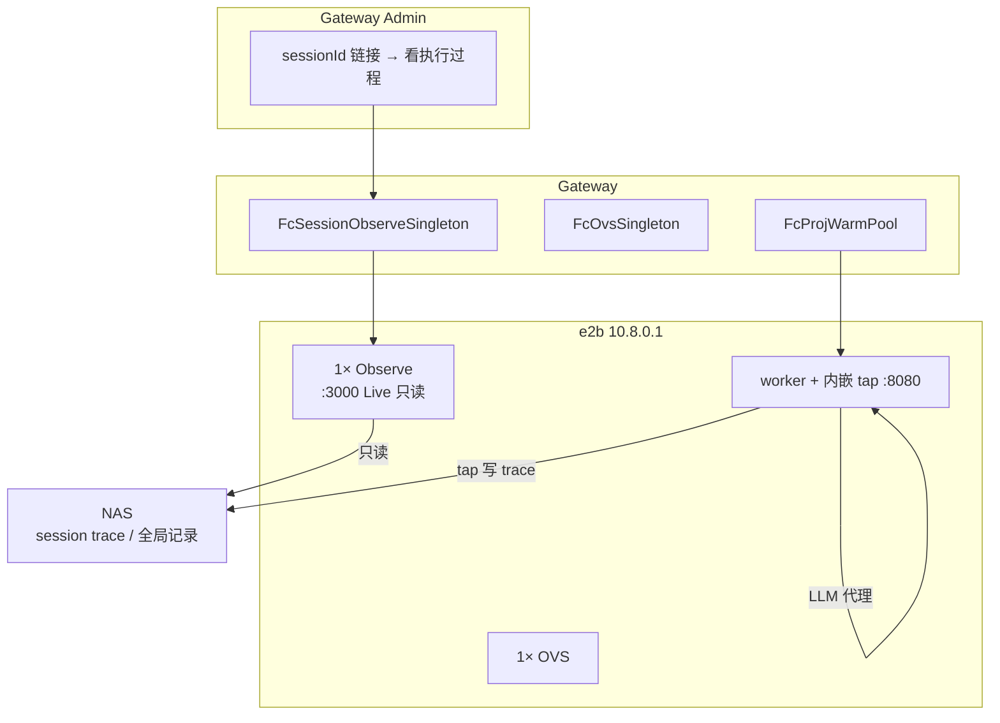

# FC Session 可观测单例 — 1 Gateway : 1 Observe : 1 OVS : N Workers

Author: kejiqing  
Status: **implemented (P1 code)** — build `claw-observe` template on e2b then verify  
Related: [FC-OVS-SINGLETON-DESIGN.md](./FC-OVS-SINGLETON-DESIGN.md)

---

## 1. 一句话（对齐版）

**e2b 再起一个稳定沙箱，只负责按 sessionId 看执行过程（读 NAS 上的 trace/记录）；不做 LLM 代理。worker 里内嵌的 claude-tap 继续代理，两者分开。**

---

## 2. 问题

| 链路 | 现状 | Admin 为何不稳定 |
|------|------|------------------|
| **LLM 代理** | worker 内 `127.0.0.1:8080` claude-tap（`fc_worker_tap.rs`） | 与 Admin **无关**，**不改** |
| **trace 落盘** | worker tap 写 NAS `tap-traces/`（需 LLM 请求带 `claw-session-id` = 对话 `record_session_id`） | 见 [OVS-INTERACTIVE-SESSION-ID.md](./OVS-INTERACTIVE-SESSION-ID.md) |
| **Admin 观测** | TurnCard 链 `liveSessionUrlTemplate` → 全局 clawTap Live | 链到 compose pool tap 或已死的 worker tap 进程 → **Live 打不开 / 空白** |

根因：**可观测入口绑在了会随 worker 生灭的服务上**（或 compose 侧 tap），而不是绑在 NAS 上已有的 trace 文件树。

---

## 3. 核心模型（两条线，不混）

```text
执行线（不变）:
  Worker 内嵌 tap :8080  →  代理 LLM  →  trace 写入 NAS

观测线（新增）:
  1 × Observe sandbox (e2b)  →  只读挂 NAS 全局 session/trace 树  →  Admin sessionId 链接
```

```text
1 × Gateway ──1:1──► 1 × Observe (e2b, 只读 Live / trace API)
                ├──1:1──► 1 × OVS (e2b)
                └──1:N──► N × Worker（内嵌 tap 代理，照旧）
```

| 不变量 | 说明 |
|--------|------|
| **Observe 不做代理** | 不监听 8080 给 worker；不替换 `OPENAI_BASE_URL` |
| **worker 内嵌 tap 保留** | `fc_worker_tap.rs` 逻辑 **不动**（代理 + 写 NAS） |
| **Observe 只读 NAS** | 挂全局 trace / session 记录目录；进程稳定、跟 Gateway 走 |
| **Admin 只链 Observe** | `liveSessionUrlTemplate` / sessionId 链接 → Observe 的 Live 或 `/api/sessions/traces` |
| **cluster probe / readyz** | 仍 probe **代理 tap**（compose pool 或后续单独约定）；**不**用 Observe 代替 strict 探针 |

---

## 4. 拓扑



---

## 5. NAS 挂载

| 沙箱 | NAS | 容器路径 | 权限 |
|------|-----|----------|------|
| **Observe 单例** | 全局 trace 根（如 `tap-traces/` 或 export 根下统一 session 树） | `/claw_observe/traces` | **只读 mount** |
| Worker session | `proj_N/sessions/{sessionId}` | `/claw_host_root` | 读写（已有） |

worker tap 继续写 session 目录；Observe 挂 **能覆盖所有 session 的 NAS 视图**（具体子路径待与现网 export 布局对齐，见 §9 待验证）。

Observe 进程示例（**无代理端口**）：

```bash
# 仅 Live / trace 浏览；--tap-no-launch 或不启 8080
claude-tap --tap-live-only ... \
  --tap-output-dir /claw_observe/traces \
  --tap-host 0.0.0.0 --tap-live-port 3000
```

（确切 CLI 以 claude-tap 支持的「只读 Live、读已有 jsonl」模式为准。）

---

## 6. Admin 链接

| 字段 | FC 模式来源 |
|------|-------------|
| `liveBaseUrl` | `http://3000-{observeSandboxId}.{CLAW_FC_DOMAIN}` |
| `liveSessionUrlTemplate` | `{liveBaseUrl}/api/sessions/traces?session={sessionId}`（统一，不用 `/?session=`） |

**不**把 worker 内 tap 的 `:8080` 暴露给 Admin Live。

---

## 7. 与 worker 内嵌 tap 的关系

| | worker 内嵌 tap | Observe 单例 |
|--|----------------|--------------|
| 目的 | LLM 代理 | 看 session 执行过程 |
| 生命周期 | 跟 worker | 跟 Gateway |
| 端口 | 8080（仅 sandbox 内） | 3000 Live（e2b traffic 对外） |
| NAS | 写 session 目录 | 只读全局 trace 树 |
| 改不改 | **不改** | **新增** |

---

## 8. 实施分期

| Phase | 交付 |
|-------|------|
| P0 | Observe template + 手动起 sandbox + NAS 只读挂 + curl Live |
| P1 | `FcSessionObserveSingleton` + Admin 派生 `liveBaseUrl` |
| P2 | E2E：worker 跑一轮 → worker 回收 → Admin sessionId 仍可打开 trace |

---

## 9. 待验证

| ID | 假设 | 怎么证 |
|----|------|--------|
| V-OBS-NAS | worker 写的 trace 路径能被 Observe 只读 mount 一次看完 | 列 NAS 上 `proj_*/sessions/*/.claw/tap-traces` vs 全局 `tap-traces` 布局 |
| V-OBS-LIVE | claude-tap Live 能按 sessionId 筛 NAS 上已有 jsonl | `GET …/api/sessions/traces?session=ovs-2` |

---

## 10. 之前文档误区（已废弃）

~~「Tap 单例替代 worker 代理、worker 不再内嵌 tap」~~ — **错误理解**，已删除。代理与观测 **必须分离**。
