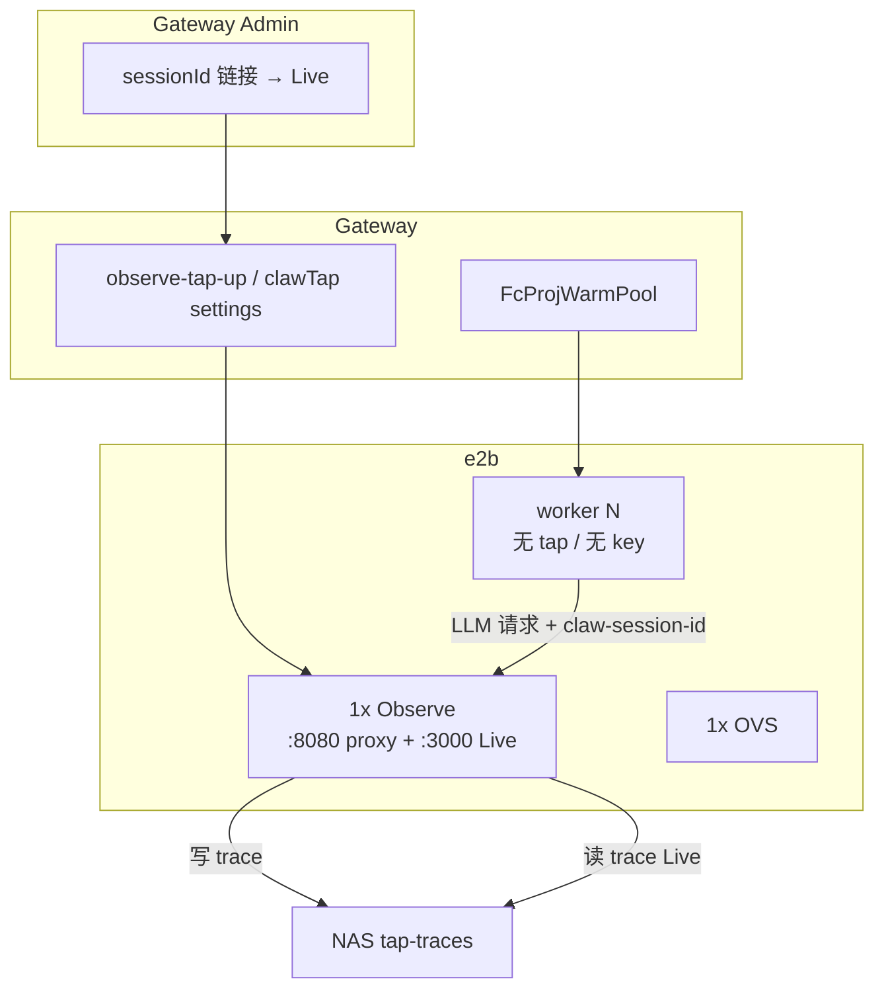

# e2b 统一 tap 单例 — 1 Gateway : 1 Observe : 1 OVS : N Workers

Author: kejiqing  
Status: **implemented** — `claw-observe` 模板 + `e2b-tap-live-up.py` + worker 去数据面  
Related: [FC-OVS-SINGLETON-DESIGN.md](./FC-OVS-SINGLETON-DESIGN.md)

---

## 1. 一句话

**e2b 起一个稳定的 observe 沙箱，同时承载 LLM 代理（8080）与 Live 观测（3000）；所有 worker 只连 observe 代理，不内嵌 tap、不持有真实 LLM 凭证、不写 trace。**

---

## 2. 问题与安全动机

| 链路 | 旧做法（已废弃） | 风险 |
|------|------------------|------|
| **LLM 代理** | 每个 worker 内嵌 `127.0.0.1:8080` claude-tap | worker 持有 `OPENAI_API_KEY`、`CLAW_GATEWAY_DATABASE_URL`；LLM 明文经 worker 落盘 |
| **trace 落盘** | worker tap 写 NAS `tap-traces/` | 不可信代码可读取 prompt/completion |
| **Admin 观测** | Live 链到 compose tap 或已死的 worker tap | Live 打不开 / 空白 |

根因：**LLM 数据面落在会执行不可信代码的 worker 层**。

---

## 3. 核心模型

```text
LLM 数据面（统一）:
  1 × Observe sandbox (e2b)
    claude-tap :8080  →  代理 LLM（cluster 模式，从 PG 注入真实 upstream+key）
    claude-tap :3000  →  Live 读 NAS trace 树

执行面（不变）:
  N × Worker  →  OPENAI_BASE_URL = observe:8080
              →  占位 OPENAI_API_KEY（observe 忽略 inbound key）
              →  无 DB URL、无 tap-traces 挂载
```

```text
1 × Gateway ──1:1──► 1 × Observe（LLM 代理 + Live）
                ├──1:1──► 1 × OVS
                └──1:N──► N × Worker（纯执行，无 LLM 数据面）
```

| 不变量 | 说明 |
|--------|------|
| **Observe = 统一 tap** | 8080 代理 + 3000 Live；`CLAW_CLUSTER_ID` + `CLAW_GATEWAY_DATABASE_URL` 只在 observe |
| **worker 无内嵌 tap** | 不启动 claude-tap、不 `/healthz` 门禁 |
| **worker 无真实凭证** | `OPENAI_API_KEY=claw-tap-cluster`（占位）；observe 从 PG 注入 |
| **worker 不写 trace** | 无 `/claw_tap_traces` 挂载；trace 由 observe 写 `/claw_ws/tap-traces` |
| **Admin Live** | `liveBaseUrl` / `proxyBaseUrl` 来自 `e2b-tap-live-up.py` 写入 PG 的 `clawTap` 设置 |

---

## 4. 拓扑



---

## 5. 配置与持久化

`deploy/e2b/e2b-tap-live-up.py` 在 observe 就绪后写入 `gateway_global_settings.settings_json.clawTap`：

| 字段 | 示例 |
|------|------|
| `mode` | `remote` |
| `host` | `8080-sbx_abc.supone.top` |
| `proxyBaseUrl` | `http://8080-sbx_abc.supone.top` |
| `liveBaseUrl` | `http://3000-sbx_abc.supone.top` |
| `e2bObserveSandboxId` | `sbx_abc` |

Gateway worker 路由（`e2b_worker_tap.rs`）读取 `proxyBaseUrl`，**不回退** `127.0.0.1:8080`。

---

## 6. Worker LLM env 契约

| 变量 | worker 值 | 说明 |
|------|-----------|------|
| `OPENAI_BASE_URL` | observe `proxyBaseUrl` | worker→observe 代理 |
| `OPENAI_API_KEY` | `claw-tap-cluster` | 占位；observe 注入真实 key |
| `CLAW_GATEWAY_DATABASE_URL` | **不注入** | 仅 observe 持有 |
| `claw-session-id` 头 | 对话 `record_session_id` | observe 按 session 写 trace |

凭证边界、PG 加密、Tap 注入契约与排障见 **[`../llm-usage-layer.md`](../llm-usage-layer.md)**。

---

## 7. 实施要点（代码）

| 模块 | 职责 |
|------|------|
| `build-claw-observe-selfhosted.py` | observe 模板 startCmd：8080 代理 + 3000 Live |
| `e2b-tap-live-up.py` | 确保 observe 单例 + 写 PG clawTap URLs |
| `e2b_worker_tap.rs` | worker LLM 路由 → observe proxy；占位 key |
| `e2b_proj_worker_registry.rs` | worker 创建**不**起本地 tap |
| `nas_paths.rs` | worker 挂载**不含** `tap-traces` |
| `claw_tap_cluster_state.rs` | e2b strict 探针 observe `/healthz` |

---

## 8. 验证

| 检查 | 期望 |
|------|------|
| worker 创建 | 无 `fc worker tap: /healthz timeout` |
| worker env | 无真实 `OPENAI_API_KEY`、无 `CLAW_GATEWAY_DATABASE_URL` |
| worker 挂载 | 无 `/claw_tap_traces` |
| solve / REPL | LLM 经 observe:8080 成功 |
| Admin Live | `liveBaseUrl` 按 sessionId 可看 trace |

---

## 9. 已废弃说法

~~「Observe 不做代理、worker 内嵌 tap 保留、代理与观测必须分离」~~ — **已废弃**。  
e2b 沙箱稳定后，**统一 tap 单例**是默认路径；worker 去数据面是安全不变量。
