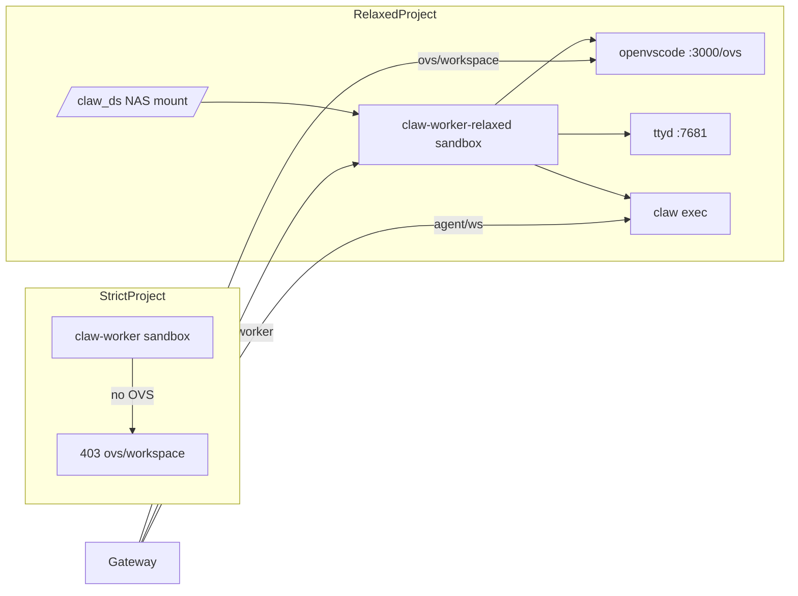

# Relaxed Worker 内置 OpenVSCode Server

Author: kejiqing

## 动机

原先 OVS 使用独立 `claw-ovs` singleton sandbox，与 per-project worker 分离，导致：

- 路径分裂（singleton 看 `/claw_ws`，worker 看 `/claw_ds`）
- 额外生命周期与 NAS 挂载复杂度
- strict 项目不应暴露 OVS 却仍有 singleton 残留

## 目标架构



## 模板

- **strict**：`claw-worker`（现有）
- **relaxed**：`claw-worker-relaxed` = strict 镜像 + OVS bundle 层

构建：

```bash
./deploy/e2b/build-claw-worker-relaxed-selfhosted.py
```

实现见 [`deploy/e2b/ovs_bundle.py`](../../deploy/e2b/ovs_bundle.py)、[`deploy/e2b/build-claw-worker-relaxed-selfhosted.py`](../../deploy/e2b/build-claw-worker-relaxed-selfhosted.py)。

## Gateway 契约

`GET /v1/projects/{projId}/ovs/workspace`：

1. 读取项目 `worker_profile`；非 relaxed → **403**
2. `ensure_worker` 取得 relaxed worker handle
3. 从 handle 派生 `ovsFolderUrl = ovsBaseUrl + ?folder=/claw_ds`

代码：[`rust/crates/http-gateway-rs/src/session_ovs_api.rs`](../../rust/crates/http-gateway-rs/src/session_ovs_api.rs)

## 废弃项

- `ensure_ovs` / `ovs-singleton` 启动（[`gateway_e2b_singleton_lifecycle.rs`](../../rust/crates/http-gateway-rs/src/gateway_e2b_singleton_lifecycle.rs)）
- 独立 OVS 模板作为 per-project IDE 路径（`claw-ovs` 模板可保留供其他用途，但 Gateway 不再 `ensure` singleton）

详见 [ACCEPTANCE.md](./ACCEPTANCE.md)。
