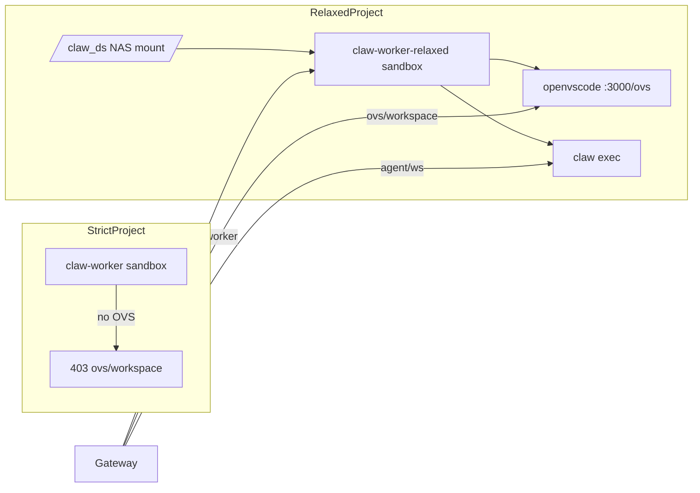

# Relaxed Worker 内置 OpenVSCode Server

> **ARCHIVED — OVS 已全面退出（2026-09-27）。** 本文仅作历史取证；现行架构见 `docs/architecture-governance.md`。`mode=relaxed` 现为宽松 worker，不再提供 OpenVSCode / `ovs/workspace`。

Author: kejiqing

## SUPERSEDED（2026-09-27）

本文描述的「relaxed = 内置 OpenVSCode」路径 **已全面退出**，不再是现行架构。

**现行 `mode=relaxed` 语义：** 权限宽松 worker（工具包 curl/git/python3/pip；project home `/claw_ds` **可写**）；**不**提供 OpenVSCode、`:3000/ovs` 或 `ovs/workspace`。

请改读：

- [`docs/architecture-governance.md`](../architecture-governance.md) §3–§4（singleton 表、worker 模式）
- [`docs/e2b-nas-workspace.md`](../e2b-nas-workspace.md)（strict ro / relaxed rw）
- [`docs/ovs-chat/ACCEPTANCE.md`](./ACCEPTANCE.md)（退出后验收）

以下正文保留为历史取证，**勿按此实施**。

---

## 动机（历史）

原先 OVS 使用独立 `claw-ovs` singleton sandbox，与 per-project worker 分离，导致：

- 路径分裂（singleton 看 `/claw_ws`，worker 看 `/claw_ds`）
- 额外生命周期与 NAS 挂载复杂度
- strict 项目不应暴露 OVS 却仍有 singleton 残留

## 目标架构（历史，已废弃）


```mermaid
flowchart LR
  subgraph strict [StrictProject]
    SW[claw-worker sandbox]
    SW -->|no OVS| X[403 ovs/workspace]
  end
  subgraph relaxed [RelaxedProject]
    RW[claw-worker-relaxed sandbox]
    RW --> OVS[openvscode :3000/ovs]
    RW --> CLAW[claw exec]
    NAS[/claw_ds NAS mount/] --> RW
  end
  GW[Gateway] -->|ensure_worker| RW
  GW -->|ovs/workspace| OVS
  GW -->|agent/ws| CLAW
```

## 模板（历史）

- **strict**：`claw-worker`（现有）
- **relaxed**：`claw-worker-relaxed` = claw + curl/git/python3/pip + OVS bundle 层

构建（脚本已删除）：

```bash
./deploy/e2b/build-claw-worker-relaxed-selfhosted.py
```

实现曾见 `deploy/e2b/ovs_bundle.py`、`deploy/e2b/build-claw-worker-relaxed-selfhosted.py`（已移除）。

## Gateway 契约（历史）

`GET /v1/projects/{projId}/ovs/workspace`：

1. 读取项目 `worker_profile`；非 relaxed → **403**
2. `ensure_worker` 取得 relaxed worker handle
3. 从 handle 派生 `ovsFolderUrl = ovsBaseUrl + ?folder=/claw_ds`

代码曾见 `session_ovs_api.rs`（已移除）。

## 废弃项（历史阶段）

- `ensure_ovs` / `ovs-singleton` 启动
- 独立 OVS 模板作为 per-project IDE 路径

详见当时 [ACCEPTANCE.md](./ACCEPTANCE.md)（现已改为退出后验收）。
