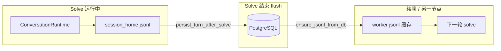

# Claw Gateway persistence model

Author: kejiqing

## Write contract（团队口径）

| 阶段 | 权威写入 | 说明 |
|------|----------|------|
| **Solve 运行中** | 会话目录本地（`.claw/gateway-solve-session.jsonl` 等） | Worker / `ConversationRuntime` 主写本地；**不要求**每条 `push_message` 同步 PG |
| **Solve 正常结束** | **Flush → PostgreSQL** | `persist_turn_after_solve`：`cc_messages`、`gateway_turns` 结果列、用量/容器等 |
| **跨请求 / 多机 / 网关重启后的续聊** | **PostgreSQL** | `ensure_jsonl_from_db` 用 DB 重建 jsonl 给 worker；BFF/API 读报告、transcript 以 PG 为准 |
| **运行中崩溃 / 取消** | 允许丢失当轮未 flush 片段 | 交接时从 **上一段已 flush 的 turn** 继续，等价于从 checkpoint **replay** |

**不是**「运行时每条消息双写 PG + jsonl」。PG 是 **交接与续聊** 的唯一真相源；本地 jsonl 是 **单轮热路径**，结束后再提交。

**性能**：相对 LLM/MCP 延迟，结束时的批量 flush 与按 session 加载通常不是瓶颈；大 `blocks` 更需控制行体积（报告走 `report_message`）。

## ID glossary

| Concept | ID | Table |
|---------|-----|--------|
| Project | `ds_id` | `gateway_projects` |
| Session | `session_id` | `gateway_sessions` |
| User turn | `turn_id` (`T_{32hex}`) | `gateway_turns` |
| Runtime iteration | `iteration_id` (UUID) | `gateway_runtime_iterations` |
| Message | `message_id` (BIGSERIAL) | `cc_messages` |
| Async task | `task_id` (= `session_id`) | `gateway_async_tasks` |

`task_id` for async solve equals `session_id`. Trace labels `turn-1`, `turn-2` are **runtime iterations** (`iteration_index`), not gateway `turn_id`.

## Tables (Phase 1)

- **`gateway_projects`** — workspace metadata per `ds_id`
- **`gateway_sessions`** — session index + `session_home_rel` (worker 挂载路径)
- **`gateway_turns`** — user turns: `user_prompt`, `report_message`, `output_json`, status
- **`cc_messages`** — `blocks` JSONB aligned with `runtime::ContentBlock`（flush 后可见）
- **`gateway_runtime_iterations`** — iteration 元数据（flush 时写入基础行）
- **`gateway_async_tasks`** — 异步任务状态；重启后可读 PG
- **`gateway_model_usage`**, **`gateway_turn_container_runs`**, **`gateway_turn_runtime_config`** — 每轮快照（solve 结束时写入，config 表待补全）
- **`gateway_session_artifacts`** — spill/trace 等（Phase 2）
- **`gateway_feedback`** — unchanged

Migrations: `rust/crates/http-gateway-rs/migrations/`，`GatewaySessionDb::connect` 时执行。

## Transcript

只读投影，数据来自 **`cc_messages`**（已 flush 的 turn），非运行中半成品。

- **Session / Turn 作用域**：`GET /v1/sessions/{sessionId}/transcript?dsId=&turnId=&format=json|jsonl`
- **可选**：`CLAW_SESSION_EXPORT_JSONL=1` 在 flush 后额外镜像 jsonl（非 SoT）

工具调用仍在 `blocks`（`tool_use` / `tool_result`）；Phase 2 可选 `cc_tool_invocations` 派生表。

## Report per turn

`GET /v1/biz_advice_report`：

1. `gateway_turns.report_message`（该 `turn_id`，须已 flush）
2. 内存中同 `turn_id` 的活跃任务
3. 该轮 `cc_messages` 提炼

**禁止**整 session jsonl 拼接作为旧轮报告回退。

## Environment

| Variable | Purpose |
|----------|---------|
| `CLAW_GATEWAY_DATABASE_URL` | PostgreSQL（交接 SoT） |
| `CLAW_GATEWAY_TEST_DATABASE_URL` | 集成测试 |
| `CLAW_SESSION_EXPORT_JSONL` | `1` = flush 后额外写盘镜像 |
