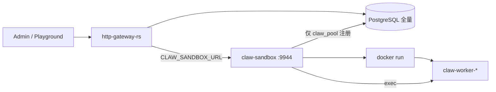
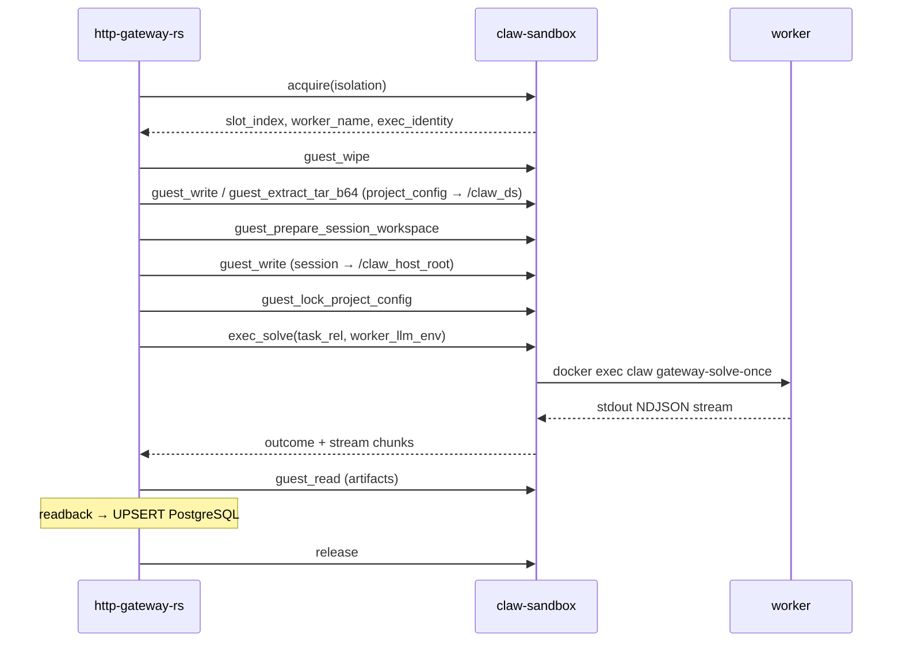

# Gateway 对 claw-sandbox 的用法（面向沙箱团队）

Author: kejiqing

本文给 **沙箱服务（`claw-sandbox`）** 维护者：说明 **http-gateway-rs 如何消费你们的服务**、边界在哪、worker 容器要满足什么契约。

系分总览：[`system-design.md`](system-design.md)。  
Worker 镜像与池侧 **`run`**：[`deploy/stack/docs/pool-worker-image-and-startup.md`](../../deploy/stack/docs/pool-worker-image-and-startup.md)。

---

## 1. 我们为什么拆出沙箱

| 以前 | 现在 |
| --- | --- |
| pool 逻辑嵌在 Gateway 或同机脚本 | **独立进程 `claw-sandbox`**（`sandbox/` workspace） |
| Gateway 可能直接碰 docker.sock | Gateway **只 HTTP RPC**；**仅沙箱**调 **`docker run` + `docker exec`** |

目标：**Gateway 与 Pool 可分机**；共享 PostgreSQL + HTTP，不共享磁盘。

---

## 2. 部署拓扑



| 组件 | 典型部署 | 端口 |
| --- | --- | --- |
| Gateway | compose `claw-gateway-rs` | `8088` |
| **claw-sandbox** | 宿主机 launchd / systemd / nohup | **`9944`** HTTP |
| Worker | 由沙箱 `run` 出的容器 | 无对外端口 |

Gateway 环境变量：**`CLAW_SANDBOX_URL`**（或 `CLAW_POOL_HTTP_BASE`），例如 `http://host.containers.internal:9944`。

---

## 3. 职责切分（契约）

### 3.1 沙箱做

| 能力 | 说明 |
| --- | --- |
| **warm / acquire / release / force_kill** | 槽位状态机 idle → leased → idle |
| **`docker run`** | 用 **Gateway 团队提供的 worker 镜像** 预热容器（见 §5） |
| **`guest_*` I/O** | 按 RPC 在容器内写/读 bytes、解压 tar |
| **`exec_solve`** | `docker exec claw gateway-solve-once`，stdout 流式回传 |
| **`capacity` / healthz** | 运维与 Gateway 探活 |
| **`claw_pool` 注册** | 心跳；Gateway 用 `pool_id` 绑 turn |

### 3.2 沙箱不做

| 不做 | 谁做 |
| --- | --- |
| session / turn 业务 SQL | Gateway `GatewaySessionDb` |
| 从 PG **理解** session_id / proj_id 语义 | Gateway 编排层 |
| materialize / readback **业务规则** | Gateway 调 RPC，但 **编排与 PG 字段**在 Gateway |
| 客户端 Live SSE | Gateway `LiveReportHub`（消费 exec stdout） |
| 构建 worker 镜像 Containerfile | Gateway 团队 `deploy/stack` + CI（沙箱 **只消费镜像 tag**） |

**验收标准（系分）**：沙箱 crate **禁止**依赖 `http-gateway-rs`；Gateway **禁止**内嵌 docker pool（走 `SandboxOrchestratedPool`）。

---

## 4. HTTP API

| 方法 | 路径 | 用途 |
| --- | --- | --- |
| `POST` | **`/v1/sandbox/rpc`** | 主 RPC（JSON 请求 / JSON 或 NDJSON 流式响应） |
| `GET` | `/healthz/live-report` | 存活 + live report hub |
| `POST` | `/v1/pool/rpc` | 遗留别名（仍可用） |

客户端：`claw-sandbox-client::SandboxRpcClient`（Gateway 侧）。

---

## 5. Worker 容器契约（沙箱 `run` 必须满足）

Gateway **假定**沙箱按下列布局起容器（与 `claw-sandbox-protocol::guest` 一致）：

| 容器内路径 | 挂载方式（当前默认） | 用途 |
| --- | --- | --- |
| **`/claw_host_root`** | tmpfs 512m | 会话工作区；`CLAW_GATEWAY_WORK_ROOT` |
| **`/claw_ds`** | tmpfs 512m | 项目配置；`CLAW_PROJECT_CONFIG_ROOT` |
| **`/run/claw/worker.env`** | 可选 ro bind | deploy 环境键 |
| **`/usr/local/bin/claw`** | 镜像内 | `gateway-solve-once` |

镜像名由部署注入沙箱环境变量：

- `CLAW_PODMAN_IMAGE` / `CLAW_DOCKER_IMAGE` — strict  
- `CLAW_RELAXED_PODMAN_IMAGE` — relaxed  

镜像由 Gateway 侧 `Containerfile.gateway-worker*` 构建，**不是**沙箱仓库职责；沙箱只需在 `run` 时引用正确 tag。

槽位创建命令形态（strict）见 [`pool-worker-image-and-startup.md`](../../deploy/stack/docs/pool-worker-image-and-startup.md) §3.2。

---

## 6. Gateway 一轮 solve 的 RPC 顺序

实现入口：`http-gateway-rs/src/pool/sandbox_orchestrator.rs`、`session_db_sync::materialize_turn_via_sandbox`。



### 6.1 RPC 表（Gateway 实际调用）

| op | Gateway 用途 |
| --- | --- |
| `acquire` | 按 ds 的 strict/relaxed 租槽；写 turn 的 `pool_id` / worker 名 |
| `guest_wipe` | 清空本轮 tmpfs |
| `guest_write` | 灌 `project_config` 到 `GuestVolume::ProjectConfig`；task/jsonl 到 `SessionWorkspace` |
| `guest_extract_tar_b64` | 续聊 `workspace_tar_gz` 解压到 session |
| `guest_prepare_session_workspace` | 跑约定 shell（目录布局） |
| `guest_lock_project_config` | `/claw_ds` chmod 只读（strict 用 pool root） |
| `exec_solve` | 主 solve；`worker_llm_env` → `exec -e` |
| `guest_read` | 终态制品 + running 时 progress 快照 |
| `guest_exec_sh` | 少量 escape（如 git 相关脚本） |
| `sync_turn_progress` | running 期间把 worker 内 progress 同步（**必须宿主机沙箱 exec**） |
| `release` / `force_kill` | 还槽 / 取消 |

Guest I/O **禁止** Gateway 传任意绝对路径；须 `volume` + `rel_path`（见 `guest.rs`）。

### 6.2 `GuestExecActor`

| actor | `exec --user` | 典型 op |
| --- | --- | --- |
| `slot_worker` | strict: `claw`；relaxed: `0:0` | guest_write、exec_solve |
| `pool_root` | `0:0` | guest_wipe、guest_lock_project_config |

`acquire` 响应里的 `exec_identity` 供 Admin 审计。

---

## 7. 与 Gateway 的共享 crate

| Crate | 位置 | 用途 |
| --- | --- | --- |
| **`claw-sandbox-protocol`** | `sandbox/crates/` | RPC 类型、guest 路径常量、OpenAPI |
| **`claw-sandbox-client`** | `sandbox/crates/` | Gateway 内 HTTP 客户端 |
| **`claw-sandbox-server`** | `sandbox/crates/` | 沙箱二进制实现 |

改 RPC 契约：**先改 protocol**，再同时升 Gateway + 沙箱二进制（同一 release tag）。

---

## 8. 环境变量（沙箱进程）

由 `deploy/stack/lib/pool-daemon-up.sh` 生成 `pool-daemon.env`（Gateway 运维链，沙箱消费）：

| 变量 | 含义 |
| --- | --- |
| `CLAW_POOL_HTTP_BIND` | 默认 `0.0.0.0:9944` |
| `CLAW_POOL_ID` | 与 Gateway 一致 |
| `CLAW_WORK_ROOT` / `CLAW_POOL_WORK_ROOT_HOST` | 宿主机工作根（槽位元数据；非 guest bind 主路径） |
| `CLAW_PODMAN_IMAGE` / `CLAW_DOCKER_IMAGE` | strict worker 镜像 |
| `CLAW_*_POOL_SIZE` / `*_MIN_IDLE` | 预热规模 |
| `CLAW_GATEWAY_DATABASE_URL` | **仅** `claw_pool` 注册用 |
| `CLAW_WORKER_ENV_FILE` | 挂载进 worker 的 deploy env 文件 |

完整列表见 `pool-daemon-up.sh` 与 [`docs/env-config.md`](../../docs/env-config.md)。

---

## 9. 验收（联调 Gateway + 沙箱）

```bash
# 沙箱 HTTP
curl -fsS http://127.0.0.1:9944/healthz/live-report

# Gateway 容器 → 宿主机沙箱（compose 内网关）
docker exec claw-gateway-rs curl -fsS http://host.docker.internal:9944/healthz/live-report
# Podman 本地研发机可用 host.containers.internal

# 与 Admin 同路径 solve（连续多轮）
./deploy/stack/lib/admin-solve-e2e.sh 1 ping
./deploy/stack/lib/admin-solve-e2e.sh 1 ping
```

**禁止**只 curl healthz 就宣称 solve 链路 OK（见 `host-pool-daemon.md` §4）。

---

## 10. 常见集成问题

| 现象 | 根因方向 |
| --- | --- |
| Gateway `connection refused :9944` | 沙箱未起；macOS 须 launchd 托管 |
| running 无 progress | Gateway 容器直接 exec worker（错误）；须沙箱 `sync_turn_progress` |
| `guest_write` 路径被拒 | 未用 `GuestVolume` + `rel_path` |
| worker 连不上 MCP/LLM | `CLAW_PODMAN_NETWORK` 与 tap 不同网；或 `EXTRA_ARGS` 缺 `add-host` |
| strict/relaxed 混用同一槽位 | 不支持；每槽固定 profile，不同镜像 |

---

## 11. 源码索引

| 路径 | 角色 |
| --- | --- |
| `sandbox/crates/claw-sandbox-server/src/pool/sandbox_rpc.rs` | RPC dispatch |
| `sandbox/crates/claw-sandbox-server/src/pool/docker_pool.rs` | **`run` / `exec` / 槽位** |
| `sandbox/crates/claw-sandbox-protocol/src/guest.rs` | 路径与 actor 契约 |
| `rust/crates/http-gateway-rs/src/pool/sandbox_orchestrator.rs` | Gateway 编排 |
| `rust/crates/http-gateway-rs/src/pool/session_db_sync.rs` | materialize / readback RPC 序列 |
