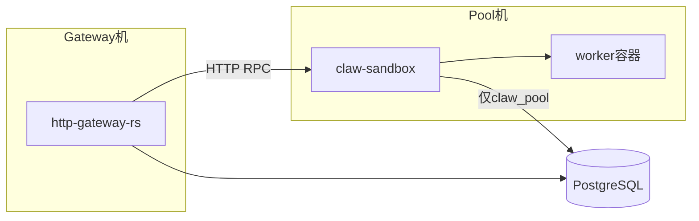

# claw-sandbox 系统详细设计（终态）

Author: kejiqing

## 一句话

**容器池**：备容器 → 按 Gateway 指令在容器内读/写/exec → 把字节还给 Gateway。  
**Gateway**：Worker 布局约定、内容编排、PG 持久化、客户端 Live SSE。

Gateway 与 Pool **可分机**；共享 PostgreSQL + HTTP RPC，不共享磁盘。

---

## 部署

| 变量 | 含义 |
|------|------|
| `CLAW_SANDBOX_URL` | Gateway → Pool HTTP 基址 |
| `CLAW_GATEWAY_DATABASE_URL` | Gateway 全量 PG；Sandbox **仅** registry |
| `CLAW_POOL_HTTP_BIND` | Pool 监听，默认 `0.0.0.0:9944` |

---

## 容器池职责

| 做 | 不做 |
|----|------|
| warm / acquire / release / force_kill | session / turn PG |
| 按 guest 路径写/读 bytes、解压 tar | materialize / readback 业务 |
| exec + stdout/stderr 流式回传 | 客户端 Live SSE |
| `claw_pool` 自注册 + 心跳 | 解析 session_id / proj_id 语义 |
| `/healthz`、capacity | ds 宿主机 bind（性能优化，非核心） |

单 Pool 进程；`acquire` 请求带 `isolation`（strict / relaxed）。**每个 profile 独立 worker 容器**（`claw-worker-{stem}-{profile}-{n}`），同一 slot 永不换 profile，避免重建开销。

---

## Gateway 职责

维护 **Worker 布局约定**（路径、tar 落点、exec 命令），例如：

- 工作根 `/claw_host_root`
- project 配置灌入 `/claw_ds`（经 RPC）；materialize 后 `guest_lock_project_config`（chmod ro）；**strict：`claw` exec；relaxed：`0:0` root exec**；会话可写仅在 `/claw_host_root`
- solve 前：PG → `guest_wipe` / `guest_write` / `guest_extract_tar_b64`
- solve：`exec` + env
- solve 后：`guest_read` → Gateway 写 PG
- Live SSE：消费 exec stdout，唯一对客户端出口

---

## RPC 契约

`POST /v1/sandbox/rpc`

### 路径边界（`claw-sandbox-protocol::guest`）

| `GuestVolume` | 挂载 | 谁写 | 谁读 |
|---------------|------|------|------|
| `session_workspace` | `/claw_host_root` | Gateway `guest_write`（slot worker） | worker solve |
| `project_config` | `/claw_ds` | Gateway `guest_write` → `guest_lock_project_config`（chmod ro） | worker `claw` solve（只读） |

Guest I/O **禁止**传裸绝对路径；用 `volume` + `rel_path`。`guest_read` 仍用绝对路径但必须在上述两棵树下。

### `GuestExecActor`

| actor | `podman exec --user` | 用途 |
|-------|----------------------|------|
| `slot_worker` | strict：`CLAW_*_POOL_EXEC_USER`（默认 `claw`）；relaxed：`0:0` | materialize 写、session 脚本、solve |
| `pool_root` | `0:0` | `guest_wipe`、`guest_lock_project_config`（strict） |

`acquire` 响应 `lease.worker_profile` + `lease.exec_identity`：`{ isolation, exec_user }`（审计 / Admin）。

| op | 请求 | 响应 |
|----|------|------|
| `acquire` | `isolation`, `timeout_ms` | `slot_index`, `worker_profile`, `worker_name`, `exec_identity` |
| `capacity` | — | `profiles[]` 按 profile 分列 idle/leased/max |
| `guest_wipe` | `slot_index` | ok（pool root） |
| `guest_write` | `slot_index`, `volume`, `rel_path`, `bytes_b64` | ok |
| `guest_extract_tar_b64` | `slot_index`, `volume`, `rel_path_prefix`, `tar_b64` | ok |
| `guest_read` | `slot_index`, `guest_paths[]` | `files[]` |
| `guest_prepare_session_workspace` | `slot_index` | ok |
| `guest_lock_project_config` | `slot_index` | ok |
| `guest_exec_sh` | `slot_index`, `script`, `actor` | ok（escape hatch） |
| `exec_solve` | `slot_index`, `task_rel`, … | 流式 chunk + `outcome` |
| `release` / `force_kill` | … | … |

单 blob cap 16 MiB。请求/响应无 PG 字段名。

---

## Crate 边界

| Crate | 职责 |
|-------|------|
| `claw-sandbox-protocol` | RPC 类型、布局常量 |
| `claw-sandbox-client` | HTTP RPC 客户端 |
| `claw-sandbox-server` | 槽位、runtime、guest I/O、registry；**禁止** `http-gateway-rs` |
| `http-gateway-rs` | 编排、PG、SSE；**禁止**内嵌 docker pool |

---

## 验收

1. `./deploy/stack/lib/admin-solve-e2e.sh` 连续多轮 `succeeded`
2. Sandbox 零 `GatewaySessionDb` / session SQL
3. Pool acquire 零 materialize / ds bind
4. macOS Pool launchd 存活

**相关文档**

- Gateway 消费本服务的 RPC 顺序与边界：[`gateway-integration.md`](gateway-integration.md)

---

## 性能优化（非本设计范围）

- Pool 宿主机 `proj_*` → `/claw_ds` bind
- NFS / staging 目录

可选 `mounts[]` 扩展，不改变主模型。
